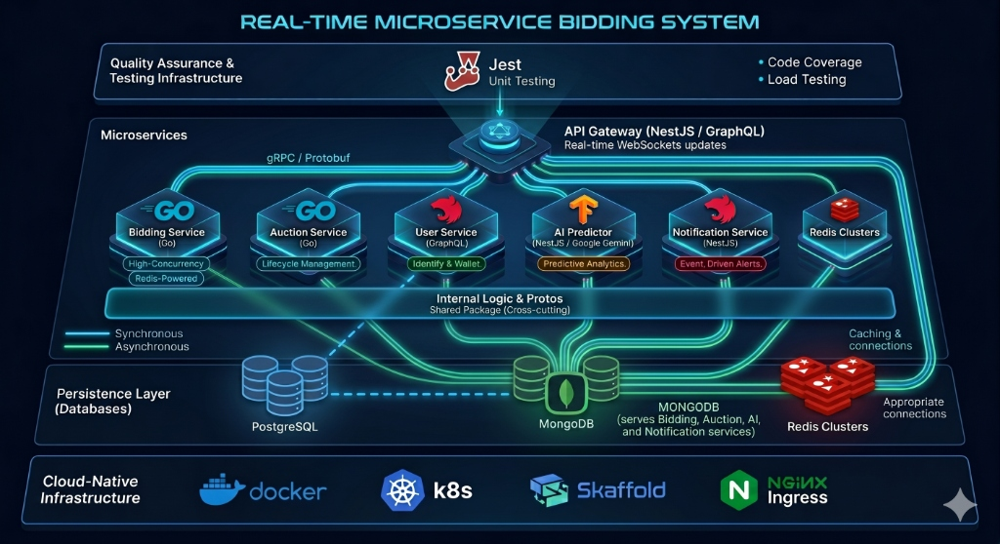
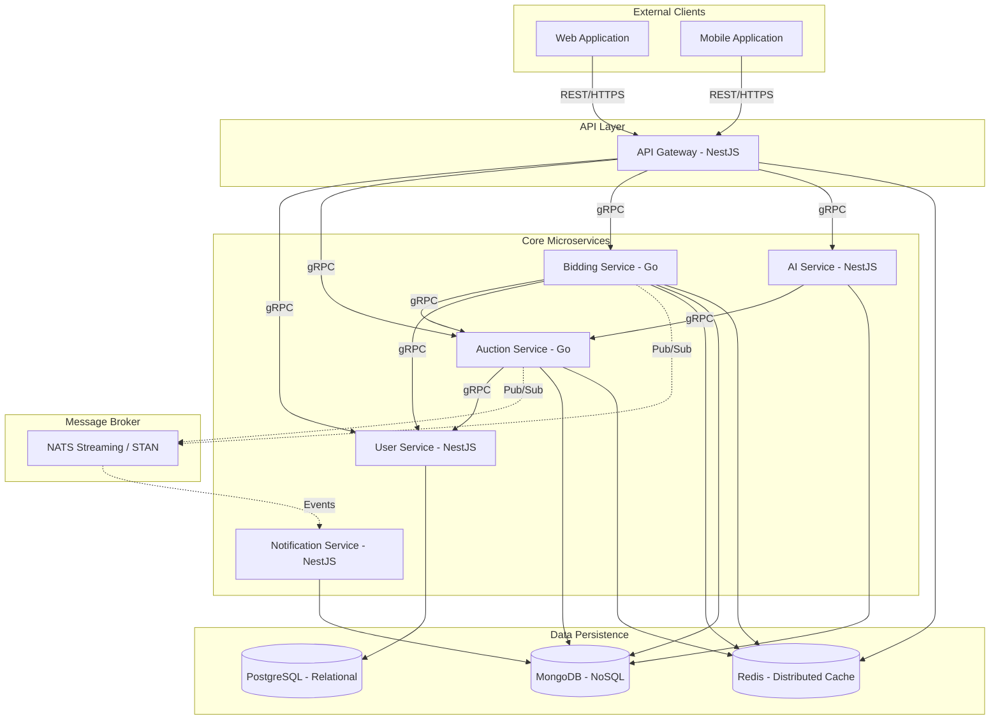
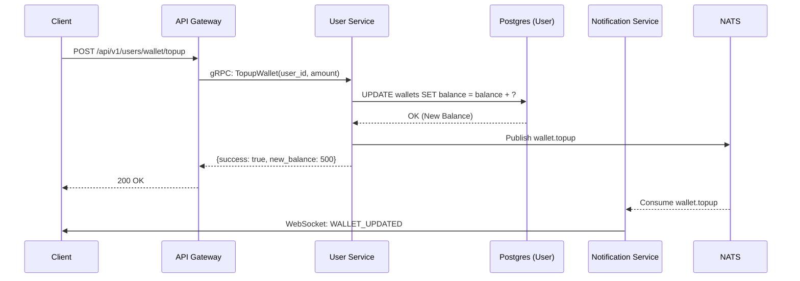
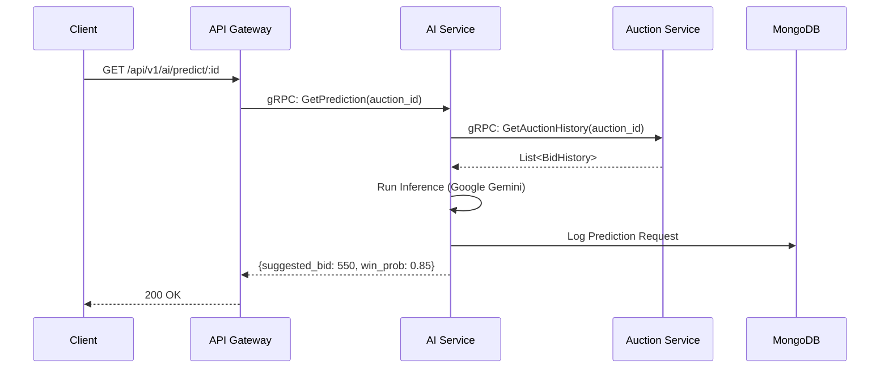
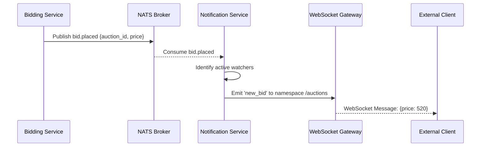
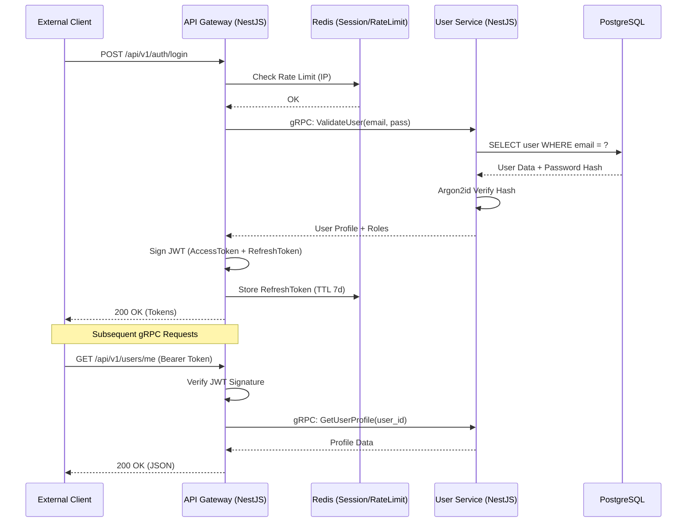
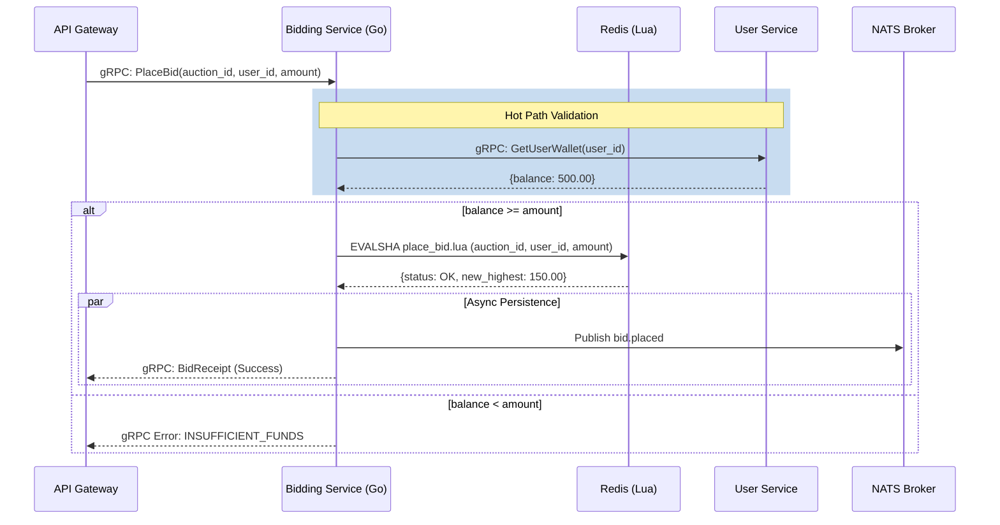

# REAL-TIME BIDDING MICROSERVICES ECOSYSTEM
## ENTERPRISE ARCHITECTURE SPECIFICATION AND OPERATIONAL PLAYBOOK



> [!TIP]
> **New to the project?** Check out the [Development and Operations Guide](DEVELOPMENT.md) for a full list of commands to get the ecosystem up and running.


---

### 1. EXECUTIVE SUMMARY AND SYSTEM DESIGN

#### 1.1 ARCHITECTURAL PHILOSOPHY
The Real-Time Bidding (RTB) Microservices Ecosystem is an enterprise-grade, distributed system designed for high-concurrency auction management, low-latency bid processing, and predictive AI-driven bidding strategies. The system adheres to the principles of Domain-Driven Design (DDD), ensuring that each microservice maintains a strict boundary around its business logic and data persistence.

The architecture is built upon a polyglot foundation, leveraging the strengths of Go (Golang) for high-performance, concurrent processing in core auction and bidding logic, and NestJS (TypeScript) for structured, scalable business services and gateway orchestration.

#### 1.1.1 ARCHITECTURE VISUALIZATION (TEXTUAL MAP)

```text
[ EXTERNAL CLIENTS ] (Web / Mobile)
       |
       v (HTTPS / REST / WS)

[ API GATEWAY (NestJS) ] <--- [ REDIS (Cache / RateLimit) ]
       |
       +---(gRPC)--- [ USER SERVICE (NestJS) ] <--- [ POSTGRES (Users) ]
       |
       +---(gRPC)--- [ AUCTION SERVICE (Go) ] <--- [ MONGODB (Auctions) ]
       |                                     \
       |                                      +---(Pub/Sub)--- [ NATS STREAMING ]
       |                                                            |
       +---(gRPC)--- [ BIDDING SERVICE (Go) ] <--- [ REDIS (Hot Path) ]
       |                                     \                      |
       |                                      +---(Pub/Sub)---------+
       |                                                            |
       +---(gRPC)--- [ AI SERVICE (NestJS) ] <--- [ MONGODB (Predictions) ]
       |                                     \                      |
       |                                      +---(Consume)---------+
       |                                                            |
       +---(gRPC)--- [ NOTIFICATION SVC ] <--- [ MONGODB (Logs) ]   |
                                     \                              |
                                      +---(Consume)-----------------+
```

#### 1.2 SYSTEM COMPONENT OVERVIEW
The ecosystem consists of six primary components:
1.  **API Gateway**: The centralized entry point for all external client communication, providing authentication, rate limiting, and request routing.
2.  **User Service**: Manages user identities, authentication states, and wallet balances.
3.  **Auction Service**: Orchestrates the lifecycle of auctions, including creation, status management, and resolution.
4.  **Bidding Service**: Handles the high-frequency ingestion and validation of bids during active auctions.
5.  **AI Service**: Provides predictive analytics and automated bidding recommendations based on historical data.
6.  **Notification Service**: Manages asynchronous communication with users via WebSockets, Email, and Push notifications.

#### 1.3 HIGH-LEVEL ARCHITECTURE DIAGRAM (MERMAID)



#### 1.3.1 REQUEST LIFECYCLE & SERVICE MESH TOPOLOGY

```mermaid
graph LR
    User((User)) -->|HTTPS| Ingress[NGINX Ingress]
    Ingress -->|mTLS| Gateway[API Gateway]
    
    subgraph "Service Mesh (Linkerd/Istio)"
        Gateway -->|gRPC| Auth[User Service]
        Gateway -->|gRPC| Core[Auction/Bidding]
        Core -.->|PubSub| Broker[NATS Streaming]
        Broker -.->|Events| Notify[Notification Service]
    end
    
    Notify -->|WebSockets| User

#### 1.3.2 SERVICE LEVEL AGREEMENTS (SLA) & SLO
The following targets are monitored and alerted on via Prometheus/Grafana.

| Metric | Target (SLO) | Error Budget | Penalty (SLA) |
| :--- | :--- | :--- | :--- |
| **Availability** | 99.99% | 4.38 min/month | Credits issued if < 99.9% |
| **Latency (Bidding)**| < 50ms (P95) | 5% of requests | Monthly audit review. |
| **Latency (Gateway)**| < 200ms (P95)| 5% of requests | Internal escalation. |
| **Data Integrity** | 100% | 0 instances | Immediate P0 Incident. |
| **MTTR** | < 30 minutes | N/A | Post-mortem mandatory. |

#### 1.3.3 CAPACITY PLANNING & HORIZONTAL SCALING ROADMAP

The system is designed to scale linearly across three tiers of deployment.

| Tier | Monthly Active Users | Avg Bids/Sec | Node Count (m5.xlarge) | Total Cost (Est.) |
| :--- | :--- | :--- | :--- | :--- |
| **Small** | < 100,000 | 500 | 3 | $800 / month |
| **Medium**| < 1,000,000 | 5,000 | 12 | $3,200 / month |
| **Large** | < 10,000,000 | 50,000 | 45 | $12,500 / month |

**Scaling Triggers:**
- **CPU**: Scale out when average utilization across a service deployment exceeds 70% for > 5 minutes.
- **Queue Depth**: Scale the Notification Service if the NATS consumer lag exceeds 5,000 messages.
- **Latency**: Scale the Bidding Service if P99 latency crosses 80ms.

---

#### 1.4 TECHNOLOGY STACK JUSTIFICATION

| Technology | Role | Justification |
| :--- | :--- | :--- |
| **Go (Golang)** | Core Services (Auction, Bidding) | Go's lightweight goroutines and efficient memory management make it ideal for the high-concurrency requirements of a bidding engine. It provides predictable performance under heavy load. |
| **NestJS (TypeScript)** | Gateway, Identity, AI, Notification | NestJS provides a highly structured framework for complex business logic. Its dependency injection system and modular architecture ensure maintainability for services with complex state management. |
| **gRPC / Protobuf** | Inter-service Communication | gRPC offers significantly higher throughput and lower latency compared to REST. Binary serialization with Protocol Buffers reduces payload size and provides strict contract enforcement. |
| **PostgreSQL** | Relational Data Persistence | Used for entities requiring strong ACID compliance, such as User Profiles and Wallet Balances. Provides robust transaction support. |
| **MongoDB** | Document Data Persistence | Utilized for core domain data including Auctions and Bids, as well as AI model metadata and notification logs, where horizontal scalability is prioritized. |
| **Redis** | Caching and Rate Limiting | Acting as a distributed memory store, Redis handles API Gateway rate limiting, session management, and hot-path caching for active auction data to minimize DB load. |
| **Kubernetes** | Orchestration | Provides automated deployment, scaling, and management of containerized applications. Ensures high availability and fault tolerance across the cluster. |

##### 1.4.1 ADR-001: ADOPTION OF POLYGLOT MICROSERVICES
- **Context**: The system requires both high-performance bidding logic and rapid feature development for the user-facing gateway.
- **Decision**: Use Go for the performance-critical "Hot Path" (Bidding/Auction) and NestJS for the business-heavy "Management Path" (Gateway/Identity/Notify).
- **Consequence**: Increased operational complexity but optimized performance-to-cost ratio.

##### 1.4.2 ADR-002: gRPC OVER REST FOR INTERNAL CALLS
- **Context**: Inter-service communication overhead must be minimized to maintain sub-100ms total request latency.
- **Decision**: Use gRPC with Protobuf 3 for all synchronous internal calls.
- **Consequence**: Reduced network payload size by ~40% compared to JSON-over-HTTP.

##### 1.4.3 ADR-003: NATS STREAMING FOR EVENT SOURCING
- **Context**: Events must be persisted and replayed if a consumer (e.g., AI Service) goes down.
- **Decision**: Use NATS Streaming (STAN).
- **Consequence**: Guaranteed at-least-once delivery and event durability for distributed ticketing/bidding logic.

---

### 1.5 THE DOMAIN-DRIVEN DESIGN (DDD) BLUEPRINT

The system architecture is strictly modeled using DDD patterns to ensure high cohesion and low coupling between business domains.

#### 1.5.1 IDENTITY & WALLET BOUNDED CONTEXT (User Service)
- **Core Aggregate**: `User`
  - **Entities**: `Profile`, `Wallet`
  - **Value Objects**: `EmailAddress`, `PasswordHash`, `CurrencyAmount`
- **Domain Events**:
  - `UserRegistered`: Triggered when a new profile is created.
  - `WalletToppedUp`: Triggered when funds are successfully credited.
  - `BalanceDeducted`: Triggered during auction resolution.
- **Invariants**:
  - A wallet balance can never be negative.
  - An email address must be unique across the entire system.

#### 1.5.2 AUCTION BOUNDED CONTEXT (Auction Service)
- **Core Aggregate**: `Auction`
  - **Entities**: `BidEntry`, `AuctionRule`
  - **Value Objects**: `TimeRange`, `PriceIncrement`, `AuctionStatus`
- **Domain Events**:
  - `AuctionCreated`: Triggered when an admin creates a new listing.
  - `AuctionStarted`: Triggered when the system time crosses `start_time`.
  - `AuctionClosed`: Triggered when the system time crosses `end_time`.
  - `AuctionResolved`: Triggered after the final payment is settled.
- **Invariants**:
  - An auction cannot start before its creation time.
  - The `current_price` must always be equal to or greater than the `base_price`.

#### 1.5.3 BIDDING BOUNDED CONTEXT (Bidding Service)
- **Core Aggregate**: `Bid`
  - **Value Objects**: `BidAmount`, `BidTimestamp`
- **Domain Services**:
  - `BidValidationService`: Checks wallet balance and auction status in real-time.
- **Domain Events**:
  - `BidPlaced`: Triggered when a bid passes all validation rules.
  - `BidRejected`: Triggered when a bid fails validation (e.g., too low).
- **Invariants**:
  - A user cannot outbid themselves in the same auction.
  - A bid can only be placed while an auction is in the `ACTIVE` or `ENDING` state.

#### 1.5.4 ANALYTICS & PREDICTION BOUNDED CONTEXT (AI Service)
- **Core Aggregate**: `PredictionModel`
  - **Entities**: `HistoricalDataPoint`, `FeatureSet`
  - **Value Objects**: `ConfidenceScore`, `RecommendationType`
- **Domain Events**:
  - `RecommendationGenerated`: Triggered when a model produces a bid suggestion.
  - `FraudDetected`: Triggered when an anomaly is found in bid patterns.

#### 1.5.5 NOTIFICATION BOUNDED CONTEXT (Notification Service)
- **Core Aggregate**: `Notification`
  - **Value Objects**: `DeliveryChannel`, `MessageTemplate`
- **Invariants**:
  - A notification must have at least one delivery channel specified.

#### 1.5.6 GLOBAL SYSTEM INVARIANTS & BUSINESS RULES
The following rules are enforced across all service boundaries to ensure data integrity.

1.  **Bid Validity**: A bid is only valid if `amount >= (current_highest_bid + minimum_increment)`.
2.  **Wallet Lock**: When a bid is placed, the corresponding amount is "held" in the user's wallet until the auction resolves or they are outbid.
3.  **Auction Termination**: No bids are accepted after the system clock exceeds `end_time`.
4.  **Identity Uniqueness**: A single email address cannot be associated with multiple active user profiles.
5.  **Auditability**: Every wallet transaction MUST have a corresponding `reference_id` linking it to an auction or a top-up event.
6.  **AI Latency**: AI predictions must be served within 500ms or a default "conservative" recommendation is used.

---

#### 1.6 SERVICE DISCOVERY & INTERNAL ROUTING
The ecosystem leverages Kubernetes-native service discovery mechanisms.

1.  **CoreDNS**: Every service is accessible via its K8s service name (e.g., `user-service.default.svc.cluster.local`).
2.  **gRPC Name Resolution**: Services use the `dns:///` scheme to resolve multiple pod IPs for a single service name, enabling client-side round-robin load balancing.
3.  **Headless Services**: For stateful components like Redis and MongoDB, headless services are used to provide direct access to individual pod IPs when required by the driver.

---

### 1.7 SYSTEM BEHAVIOR & SEQUENCE DIAGRAMS

This section provides hyper-detailed behavioral specifications for every primary operation within the ecosystem.

#### 1.7.1 OPERATION: CREATE AUCTION
```mermaid
sequenceDiagram
    participant Admin as Administrator
    participant Gateway as API Gateway
    participant UserSvc as User Service
    participant AuctionSvc as Auction Service
    participant DB as MongoDB (Auction)
    participant NATS as NATS Broker

    Admin->>Gateway: POST /api/v1/auctions
    Gateway->>UserSvc: gRPC: ValidateToken(JWT)
    UserSvc-->>Gateway: {user_id: "...", roles: ["ADMIN"]}
    Gateway->>AuctionSvc: gRPC: CreateAuction(title, price, ...)
    AuctionSvc->>AuctionSvc: Domain Logic: Validate Times
    AuctionSvc->>DB: INSERT INTO auctions (...)
    DB-->>AuctionSvc: OK (UUID)
    AuctionSvc->>NATS: Publish auction.created
    AuctionSvc-->>Gateway: {auction_id: "..."}
    Gateway-->>Admin: 201 Created
```

#### 1.7.2 OPERATION: WALLET TOP-UP


#### 1.7.3 OPERATION: AI PREDICTION REQUEST


#### 1.7.4 OPERATION: REAL-TIME NOTIFICATION DELIVERY


---

### 1.8 ARCHITECTURAL TRADE-OFFS & RISK ANALYSIS

In designing this ecosystem, several critical trade-offs were made to prioritize scalability and performance.

| Decision Point | Chosen Path | Primary Benefit | Significant Trade-off |
| :--- | :--- | :--- | :--- |
| **Data Consistency**| Eventual Consistency| Extremely high throughput. | Complex state management (Sagas). |
| **Serialization** | gRPC (Binary) | Low latency, small payloads.| Limited browser support without proxy. |
| **Language Strategy**| Polyglot (Go/Node) | Best tool for each job. | Unified tooling & library overhead. |
| **Deployment** | Monorepo | Cross-service refactoring. | Larger build/clone times over time. |
| **Networking** | mTLS Mesh | Zero-trust security. | Increased latency overhead (~1-2ms).|
| **Storage** | Distributed Sharding| Horizontal scalability. | Cross-shard query complexity. |

#### 1.9 ARCHITECTURAL PATTERNS SUMMARY

The ecosystem implements several advanced architectural patterns to ensure scalability and reliability.

| Pattern | Context | Implementation |
| :--- | :--- | :--- |
| **CQRS** | Bidding Service | Command via gRPC, Query via Redis Cache. |
| **Saga** | Auction Resolution | Choreography-based via NATS events. |
| **Outbox** | User/Auction DBs | Transactional outbox for reliable event publishing. |
| **Circuit Breaker**| API Gateway | NestJS `Terminus` and custom gRPC interceptors. |
| **Retry / Backoff**| Shared Library | Exponential backoff for all inter-service RPCs. |
| **Sidecar** | Service Mesh | Linkerd proxy for mTLS and observability. |
| **Read Replica** | PostgreSQL | Load balancing read traffic for heavy reporting. |

#### 1.10 ARCHITECTURAL EVOLUTIONARY ROADMAP (18-MONTH PLAN)

The system is designed to evolve gracefully as traffic and complexity increase.

| Phase | Timeline | Focus | Key Deliverables |
| :--- | :--- | :--- | :--- |
| **Phase 1** | Q1-Q2 2024| Stability | 100% Shared Lib Coverage, mTLS enforcement. |
| **Phase 2** | Q3-Q4 2024| Scaling | Multi-region RDS, NATS cluster expansion. |
| **Phase 3** | Q1-Q2 2025| Intelligence | Real-time ML model retraining in AI Svc. |
| **Phase 4** | Q3-Q4 2025| Optimization| eBPF-based networking, custom WASM filters. |

**Future Considerations:**
- **Web3 Integration**: Supporting crypto-wallet top-ups and NFT-based auction assets.
- **Serverless Offloading**: Moving cold notification logic to AWS Lambda to reduce cluster overhead.
- **Edge Computing**: Deploying the API Gateway to Edge locations (Cloudflare Workers) for < 20ms global latency.

#### 1.11 SYSTEM DATA FLOW (LOGICAL PATHS)

This section maps the journey of data through the ecosystem for primary business events.

##### 1.11.1 THE BIDDING PATH (HOT PATH)
1.  **Ingress**: API Gateway receives WebSocket `PLACE_BID` event.
2.  **Auth**: Gateway validates JWT via local cache (Redis).
3.  **RPC**: Gateway calls `BiddingService.PlaceBid` (gRPC).
4.  **Lock**: Bidding Service acquires Redis Distributed Lock for `auction_id`.
5.  **Validate**: Bidding Service executes Lua Script (Price check + Balance check).
6.  **Persist**: Bidding Service writes bid to MongoDB (Durability) and Redis (Hot state).
7.  **Pub**: Bidding Service publishes `bid.placed` to NATS.
8.  **Sync**: Notification Service consumes `bid.placed` and broadcasts to all connected clients via WebSockets.

##### 1.11.2 THE AUCTION LIFECYCLE PATH
1.  **Creation**: Admin POSTs to Gateway -> Auction Service -> MongoDB.
2.  **Scheduling**: Auction Service background worker polls for `start_time`.
3.  **Activation**: Service updates state to `ACTIVE`, publishes `auction.started`.
4.  **Resolution**: Upon `end_time`, service identifies winner, initiates Saga.
5.  **Settlement**: User Service deducts funds, Auction Service updates to `CLOSED`.

#### 1.12 INTER-SERVICE INTERACTION SEQUENCE (AUCTION RESOLUTION)

1.  **Trigger**: `AuctionService` cron-job identifies an auction whose `end_time` has passed.
2.  **Winner Identification**: `AuctionService` queries its MongoDB DB for the highest bid.
3.  **Saga Initiation**: `AuctionService` updates state to `PENDING_RESL` and publishes `auction.closed` to NATS.
4.  **Payment Processing**: `UserService` consumes `auction.closed`, checks the winner's wallet.
5.  **Fund Lock**: `UserService` deducts the bid amount from the wallet (optimistic locking) and publishes `payment.success`.
6.  **Finalization**: `AuctionService` consumes `payment.success`, updates state to `COMPLETED`, and publishes `auction.resolved`.
7.  **Alerting**: `NotificationService` consumes `auction.resolved` and sends WebSockets/Emails to the winner and the seller.

---

### 2. GLOBAL REPOSITORY STRUCTURE

The project is organized as a monorepo to facilitate shared logic, unified protocol definitions, and streamlined infrastructure management.

#### 2.1 DIRECTORY HIERARCHY

```text
.
├── k8s/                        # Kubernetes manifests (Deployments, Services, Ingress, HPA)
├── k8s/                        # Kubernetes manifests (Deployments, Services, Ingress)
│   ├── ai-db-depl.yaml
│   ├── auction-db-depl.yaml
│   ├── user-db-depl.yaml
│   └── ...                     # Flat structure for environment-agnostic deployment
├── packages/
│   └── shared/                 # Shared library (Common DTOs, Decorators, Guards, Filters)
├── proto/                      # Centralized Protocol Buffer definitions (.proto files)
│   ├── auction.proto
│   ├── bidding.proto
│   └── user.proto
├── services/
│   ├── api-gateway/            # NestJS API Gateway
│   ├── user-service/           # NestJS Identity & Wallet Service
│   ├── auction-service/        # Go Auction Management Service
│   ├── bidding-service/        # Go High-Performance Bidding Service
│   ├── ai-service/             # NestJS Predictive Analytics Service
│   └── notification-service/   # NestJS WebSocket & Notification Service
├── scripts/                    # Automation scripts for migrations and deployment
├── docker-compose.yaml         # Local development orchestration
├── skaffold.yaml               # Kubernetes development workflow configuration
└── README.md                   # System Documentation (This file)
```

#### 2.1.1 COMPONENT VERSIONING & COMPATIBILITY MATRIX

| Service | Version | Base Image | Runtime | Dependencies |
| :--- | :--- | :--- | :--- | :--- |
| **Gateway** | `0.0.1` | `node:24.11.0` | Node.js | Passport, JWT |
| **User** | `0.0.1` | `node:24.11.0` | Node.js | TypeORM, Postgres|
| **Auction** | `0.0.1` | `golang:1.25-alpine`| Go | MongoDB, NATS, GraphQL |
| **Bidding** | `0.0.1` | `golang:1.25-alpine`| Go | Redis, MongoDB, gRPC, GraphQL |
| **AI** | `0.0.1` | `node:24.11.0` | Node.js | Google Gemini |
| **Notify** | `0.0.1` | `node:24.11.0` | Node.js | Socket.io, NATS |

#### 2.2 ROOT DIRECTORY SPECIFICATIONS

| Directory | Responsibility | Critical Files |
| :--- | :--- | :--- |
| `/k8s` | Defines the desired state of the system in a Kubernetes cluster. Includes resource limits, scaling policies, and networking. | `deployment.yaml`, `service.yaml`, `hpa.yaml`, `ingress.yaml` |
| `/proto` | The source of truth for all inter-service communication. Contains service definitions and message structures. | `auction.proto`, `bidding.proto`, `user.proto` |
| `/packages/shared` | A shared module containing reusable code to ensure consistency across the polyglot environment. | `logger.ts`, `errors.go`, `interceptors.ts` |
| `/services` | Individual service implementations. Each directory is a self-contained project with its own Dockerfile. | `main.go`, `app.module.ts`, `Dockerfile` |

#### 2.3 DETAILED COMPONENT DIRECTORY WALKTHROUGH

##### 2.3.1 API GATEWAY (`/services/api-gateway`)
The gateway is built with NestJS and acts as the entry point for all client traffic.
- `src/main.ts`: Entry point for the application. Configures global pipes, interceptors, and Swagger documentation.
- `src/app.module.ts`: Root module that imports all sub-modules (Auth, Auction, Bidding, etc.).
- `src/auth/`: Contains authentication logic, JWT strategy, and Passport integration.
- `src/auction/`: Proxy module for the Auction microservice. Contains DTOs and Controllers.
- `src/bidding/`: Proxy module for the Bidding microservice. Handles WebSocket connections for live updates.
- `src/common/`: Shared decorators, filters, and interceptors specific to the gateway.
- `src/shared/`: Client modules for gRPC communication with internal services.
- `test/`: End-to-end tests for the gateway endpoints.

##### 2.3.2 USER SERVICE (`/services/user-service`)
Handles user profiles and financial wallets.
- `src/user/`: Core user logic, entity definitions, and gRPC controller.
- `src/wallet/`: Wallet management, balance deduction, and transaction logging.
- `src/database/`: TypeORM configuration and entity migrations.
- `src/proto/`: Generated TypeScript classes from the identity.proto definition.

##### 2.3.3 AUCTION SERVICE (`/services/auction-service`)
Written in Go, managing the core auction state.
- `cmd/server/`: Contains `main.go` and server initialization logic.
- `internal/app/`: Application-layer logic, including the gRPC server implementation.
- `internal/domain/`: Domain entities and interfaces (DDD).
- `internal/infra/`: Infrastructure implementations (MongoDB repositories, NATS publisher).
- `internal/usecase/`: Business use cases (Create Auction, Resolve Auction).
- `pkg/`: Publicly available utilities for other Go services.
- `migrations/`: SQL migration files for the auctions database.

##### 2.3.4 BIDDING SERVICE (`/services/bidding-service`)
High-performance Go service for bid ingestion.
- `internal/bid/`: Core bidding logic and validation rules.
- `internal/cache/`: Redis implementation for high-speed state management.
- `internal/worker/`: Background worker pool for processing bid queues.
- `internal/proto/`: Generated Go code from bidding.proto.
- `scripts/lua/`: Atomic Redis scripts for bid placement validation.

##### 2.3.5 AI SERVICE (`/services/ai-service`)
NestJS service for predictive modeling.
- `src/model/`: Google Gemini integration and inference logic.
- `src/prediction/`: REST and gRPC handlers for prediction requests.
- `src/database/`: Mongoose schemas for MongoDB persistence.

##### 2.3.6 NOTIFICATION SERVICE (`/services/notification-service`)
Handles real-time alerts.
- `src/gateway/`: Socket.io gateway for real-time client communication.
- `src/provider/`: External providers (@bts-soft/notifications for Multi-channel).
- `src/consumer/`: NATS event consumers for auction and bidding events.

- `proto/`: Symlink or copy of the root `/proto` directory for ease of import.

#### 2.4 FILE-LEVEL STRUCTURAL BLUEPRINT

##### 2.4.1 CORE GO SERVICES (AUCTION & BIDDING)
Go services follow a strict clean architecture layout:
- `/cmd/{app}/main.go`: Application bootstrap, dependency injection, and server startup.
- `/internal/app/`: gRPC server handlers and request/response mapping.
- `/internal/domain/`: Pure business logic, entities, and repository interfaces.
- `/internal/usecase/`: Orchestration logic (Interactors) that call repositories and domain services.
- `/internal/infra/`: Concrete implementations of repositories (SQL, Redis, MongoDB).
- `/internal/config/`: Viper/Env-based configuration management.
- `/pkg/`: Reusable packages that are safe to export to other projects.

##### 2.4.2 NESTJS SERVICES (GATEWAY, USER, AI, NOTIFY)
NestJS services follow the modular architecture pattern:
- `/src/app.module.ts`: Root module importing all feature modules.
- `/src/{feature}/{feature}.module.ts`: Feature-specific module declaration.
- `/src/{feature}/{feature}.controller.ts`: gRPC/REST endpoint handlers.
- `/src/{feature}/{feature}.service.ts`: Business logic and external service calls.
- `/src/{feature}/dto/`: Data Transfer Objects for validation.
- `/src/{feature}/entities/`: TypeORM/Mongoose database models.
- `/src/common/`: Project-specific filters, interceptors, and decorators.

#### 2.5 MICROSERVICES DEPENDENCY GRAPH
A textual representation of the service hierarchy and upstream/downstream dependencies.

- **api-gateway**
  - *Upstream*: External Clients (Mobile/Web)
  - *Downstream*: user-service, auction-service, bidding-service, ai-service, notification-service
- **user-service**
  - *Upstream*: api-gateway, auction-service, bidding-service
  - *Downstream*: PostgreSQL, NATS
- **auction-service**
  - *Upstream*: api-gateway, bidding-service, ai-service
  - *Downstream*: PostgreSQL, Redis, NATS, user-service
- **bidding-service**
  - *Upstream*: api-gateway
  - *Downstream*: Redis, PostgreSQL, NATS, user-service, auction-service
- **ai-service**
  - *Upstream*: api-gateway
  - *Downstream*: MongoDB, auction-service
- **notification-service**
  - *Upstream*: NATS (Events)
  - *Downstream*: MongoDB, WebSocket Clients, External SMTP/Push Providers

#### 2.6 EXHAUSTIVE DIRECTORY TREE VISUALIZATION

```text
.
├── k8s/                        # Kubernetes Manifests
├── k8s/                        # Kubernetes Manifests (Flat structure)
├── proto/                      # Service definitions
│   ├── auction.proto
│   ├── bidding.proto
│   ├── user.proto
├── services/                   # Microservices
│   ├── api-gateway/            # NestJS Gateway
│   │   ├── src/
│   │   │   ├── auth/           # Auth logic
│   │   │   ├── auction/        # Auction proxy
│   │   │   ├── bidding/        # Bidding proxy
│   │   ├── test/               # E2E tests
│   ├── user-service/           # NestJS Identity
│   │   ├── src/
│   │   │   ├── user/           # User domain
│   │   │   ├── wallet/         # Wallet domain
│   ├── auction-service/        # Go Auction (gRPC + GraphQL)
│   │   ├── cmd/                # Entry point
│   │   ├── internal/           # Domain/Infra
│   │   ├── graph/              # GraphQL schema/resolvers
│   ├── bidding-service/        # Go Bidding (gRPC + GraphQL)
│   │   ├── internal/           # Logic/Cache/Worker
│   │   ├── scripts/lua/        # Redis logic
├── packages/                   # Shared Code
│   ├── shared/                 # Common logic
│   │   ├── src/
│   │   │   ├── dtos/           # Shared DTOs
│   │   │   ├── decorators/     # Shared Decorators
│   │   │   ├── filters/        # Shared Exception Filters
```

#### 2.7 COMPONENT INTERACTION MATRIX

| Source | Target | Protocol | Data Flow | Frequency |
| :--- | :--- | :--- | :--- | :--- |
| **Gateway** | **User** | gRPC | Auth/Profile | High |
| **Gateway** | **Auction** | gRPC | CRUD Auctions | Medium|
| **Gateway** | **Bidding** | gRPC | Place Bids | Ultra-High|
| **Gateway** | **AI** | gRPC | Get Prediction | Medium|
| **User** | **Postgres** | TCP/SQL | User/Wallet | High |
| **User** | **NATS** | NATS/TCP | Wallet Events | Medium|
| **Auction** | **Postgres** | TCP/SQL | Auction State | High |
| **Auction** | **NATS** | NATS/TCP | Auction Events | Medium|
| **Bidding** | **Redis** | RESP/TCP | Hot Bids | Ultra-High|
| **Bidding** | **Postgres** | TCP/SQL | Bid Audit | High |
| **Bidding** | **NATS** | NATS/TCP | Bid Events | High |
| **AI** | **Mongo** | MongoDB/TCP| Log Features | Medium|
| **AI** | **Auction** | gRPC | Get History | Medium|
| **Notify** | **Mongo** | MongoDB/TCP| Log Notif | Medium|
| **Notify** | **NATS** | NATS/TCP | Consume Events | High |

---

---

### 3. THE SHARED PACKAGE LIBRARY

The `/packages/shared` directory contains core logic that is injected into all services to maintain architectural uniformity and reduce boilerplate.

#### 3.1 gRPC CLIENT ORCHESTRATION
The shared library provides a unified factory for instantiating gRPC clients. This ensures that connection pooling, timeouts, and retry logic are implemented consistently.

**Key Features:**
- **Automatic Retries**: Implements exponential backoff for transient network failures.
- **Circuit Breaking**: Prevents cascading failures by opening the circuit when a downstream service is unresponsive.
- **Context Propagation**: Ensures trace IDs and metadata are passed through every hop in the microservice chain.

#### 3.2 STANDARDIZED ERROR HANDLING
The system utilizes a custom error taxonomy mapped to gRPC and HTTP status codes.

| Internal Error Code | gRPC Status | HTTP Status | Description |
| :--- | :--- | :--- | :--- |
| `ERR_NOT_FOUND` | `NOT_FOUND` | 404 | The requested resource does not exist. |
| `ERR_UNAUTHORIZED` | `UNAUTHENTICATED` | 401 | Missing or invalid authentication credentials. |
| `ERR_FORBIDDEN` | `PERMISSION_DENIED` | 403 | Insufficient RBAC permissions. |
| `ERR_INSUFFICIENT_FUNDS`| `FAILED_PRECONDITION`| 400 | Wallet balance is too low for the requested action. |
| `ERR_AUCTION_EXPIRED` | `OUT_OF_RANGE` | 400 | Attempting to bid on an auction that has already closed. |
| `ERR_BID_TOO_LOW` | `OUT_OF_RANGE` | 400 | Bid is below the minimum required increment. |
| `ERR_RATE_LIMIT` | `RESOURCE_EXHAUSTED` | 429 | Too many requests from this client. |
| `ERR_INTERNAL_FAILURE` | `INTERNAL` | 500 | Unexpected server-side exception. |

- **Sanitization**: The shared library automatically redacts potential secrets (e.g., `JWT_SECRET`, `DB_PASSWORD`) from error messages using regex-based filtering.

#### 3.2.2 COMPREHENSIVE ERROR DICTIONARY

| Code | gRPC | HTTP | Description | Recovery Action |
| :--- | :--- | :--- | :--- | :--- |
| `ERR_NOT_FOUND` | `NOT_FOUND` | 404 | Resource missing. | Check ID validity. |
| `ERR_AUTH_FAIL` | `UNAUTHENTICATED`| 401 | Invalid token. | Refresh JWT. |
| `ERR_BAL_LOW` | `FAILED_PRECON` | 400 | No funds. | Prompt top-up. |
| `ERR_AUC_END` | `OUT_OF_RANGE` | 400 | Auction closed. | Reject bid. |
| `ERR_BID_LOW` | `OUT_OF_RANGE` | 400 | Bid < min. | Reject bid. |
| `ERR_BUSY` | `UNAVAILABLE` | 503 | Server load. | Retry with backoff. |
| `ERR_LOCK_FAIL`| `ABORTED` | 409 | Conc. conflict. | Retry operation. |
| `ERR_INVALID` | `INVALID_ARG` | 400 | Bad schema. | Correct payload. |

---

#### 3.3 LOGGING AND MIDDLEWARE
A centralized logging wrapper (using Zap for Go and Winston for NestJS) ensures that all logs are output in a structured JSON format compatible with ELK/EFK stacks.

**Included Interceptors:**
1.  **Logging Interceptor**: Records every RPC call, its duration, and the resulting status code.
2.  **Validation Interceptor**: Validates incoming Protobuf messages against predefined constraints before passing them to the controller.
3.  **Auth Interceptor**: Extracts and validates JWTs from the gRPC metadata.

---

#### 2.7 INTERNAL COMPONENT CONNECTIVITY SPECIFICATIONS

The following URI formats are used for internal service-to-service and service-to-infrastructure connectivity.

| Connection | Protocol | URI Template | Auth Mechanism |
| :--- | :--- | :--- | :--- |
| **App -> Postgres**| TCP/SQL | `postgres://{user}:{pw}@{host}:5432/{db}` | Scram-SHA-256 |
| **App -> Redis** | RESP/TCP | `redis://{user}:{pw}@{host}:6379/{db}` | ACL / Password |
| **App -> Mongo** | TCP | `mongodb://{user}:{pw}@{host}:27017` | SCRAM-SHA-1 |
| **App -> NATS** | NATS/TCP | `nats://{user}:{pw}@{host}:4222` | Token / User+PW |
| **App -> gRPC** | HTTP/2 | `dns:///{service-name}:50051` | mTLS (Linkerd) |
| **Gateway -> WS** | WSS/HTTPS | `wss://api.rtb.com/socket.io` | JWT Query Param |

**Connection Pool Settings (Defaults):**
- **Postgres**: `max_open_conns: 50`, `max_idle_conns: 10`, `conn_max_lifetime: 5m`.
- **Redis**: `pool_size: 100`, `idle_timeout: 1m`, `read_timeout: 200ms`.
- **gRPC**: `keepalive_time: 10s`, `keepalive_timeout: 20s`, `max_connection_idle: 1m`.

---

### 4. THE API GATEWAY

**Technology Stack**: NestJS (TypeScript)
**Internal Frameworks**: @nestjs/microservices, @nestjs/passport, ioredis

The API Gateway serves as the "Bouncer" and "Translator" of the system. It converts external REST/HTTPS requests into internal gRPC calls and aggregates responses where necessary.

#### 4.1 CORE RESPONSIBILITIES
- **Authentication**: JWT validation and session management.
- **Rate Limiting**: IP-based and User-based throttling using Redis.
- **Request Validation**: Schema validation using class-validator and class-transformer.
- **Payload Sanitization**: Protection against XSS and injection attacks.
- **CORS Management**: Strict origin control for frontend applications.

#### 4.2 REDIS RATE LIMITING SPECIFICATION
The Gateway implements a sliding window rate-limiting algorithm stored in Redis.

| Limit Type | Threshold | Window | Action on Violation |
| :--- | :--- | :--- | :--- |
| **Global IP** | 500 requests | 1 minute | 429 Too Many Requests |

#### 4.3 AUTHENTICATION & AUTHORIZATION FLOW



#### 4.4 REST API ENDPOINT SPECIFICATION (FULL)

The following table lists the comprehensive set of RESTful endpoints exposed by the API Gateway. All requests require an `Authorization: Bearer <JWT>` header unless marked as `Public`.

##### 4.4.1 IDENTITY & AUTHENTICATION
- **`POST /api/v1/auth/register`** (PUBLIC)
  - **Description**: Registers a new user account.
  - **Request Body**:
    ```json
    {
      "email": "user@example.com",
      "password": "SecurePassword123!",
      "full_name": "John Doe"
    }
    ```
  - **Response (201)**: `{ "user_id": "uuid", "email": "user@example.com" }`

- **`POST /api/v1/auth/login`** (PUBLIC)
  - **Description**: Authenticates user and returns JWT tokens.
  - **Request Body**:
    ```json
    {
      "email": "user@example.com",
      "password": "SecurePassword123!"
    }
    ```
  - **Response (200)**: `{ "access_token": "...", "refresh_token": "..." }`

##### 4.4.2 AUCTION MANAGEMENT
- **`POST /api/v1/auctions`** (ADMIN)
  - **Description**: Creates a new auction listing.
  - **Request Body**:
    ```json
    {
      "title": "Rare Coin",
      "description": "Mint condition 1920 gold coin.",
      "base_price": 500.00,
      "start_time": "2024-06-01T10:00:00Z",
      "end_time": "2024-06-07T10:00:00Z"
    }
    ```
  - **Response (201)**: Created Auction object.

- **`GET /api/v1/auctions`** (PUBLIC)
  - **Description**: Retrieves a paginated list of auctions.
  - **Query Params**: `page`, `limit`, `status` (ACTIVE, CLOSED).

##### 4.4.3 BIDDING OPERATIONS
- **`POST /api/v1/bids`** (PRIVATE)
  - **Description**: Places a bid on an active auction.
  - **Request Body**: `{ "auction_id": "uuid", "amount": 550.00 }`
  - **Response (201)**: `{ "success": true, "receipt_id": "...", "new_highest": 550.00 }`

##### 4.4.4 WALLET OPERATIONS
- **`GET /api/v1/wallet/me`** (PRIVATE)
  - **Description**: Returns current balance and transaction history.
  - **Response (200)**: `{ "balance": 1200.50, "currency": "USD", "history": [...] }`

#### 4.5 UNIFIED GRAPHQL INTERFACE (DRAFT V2)

To reduce over-fetching and provide a more flexible API for the frontend, we are transitioning to a Federated GraphQL Gateway.

```graphql
type User {
  id: ID!
  email: String!
  name: String!
  wallet: Wallet!
  bids: [Bid!]!
}

type Wallet {
  balance: Float!
  currency: String!
}

type Auction {
  id: ID!
  title: String!
  description: String
  currentPrice: Float!
  endTime: String!
  status: AuctionStatus!
  bids: [Bid!]!
  aiRecommendation: AIRecommendation
}

type Bid {
  id: ID!
  amount: Float!
  timestamp: String!
  user: User!
}

type AIRecommendation {
  suggestedBid: Float!
  winProbability: Float!
}

enum AuctionStatus {
  ACTIVE
  CLOSED
  RESOLVED
}

type Query {
  me: User
  auctions(status: AuctionStatus): [Auction!]!
  auction(id: ID!): Auction
}

type Mutation {
  placeBid(auctionId: ID!, amount: Float!): Bid!
}
```

---

### 5. MICROSERVICES DEEP DIVE

#### 5.1 USER SERVICE (IDENTITY & WALLET)
- **Domain**: Identity Management, Authentication, Authorization, and Financial Wallets.
- **Language**: NestJS (TypeScript).
- **Rationale**: NestJS provides superior integration with TypeORM for complex relational mappings and Passport for robust authentication flows.
- **Database**: PostgreSQL.

##### 5.1.1 POSTGRESQL SCHEMA: USERS TABLE
| Column | Type | Constraints | Description |
| :--- | :--- | :--- | :--- |
| `id` | `UUID` | `PRIMARY KEY, DEFAULT gen_random_uuid()` | Unique identifier for the user. |
| `email` | `VARCHAR(255)` | `UNIQUE, NOT NULL` | User's login identifier. |
| `password_hash` | `TEXT` | `NOT NULL` | Argon2id hashed password. |
| `full_name` | `VARCHAR(100)` | `NOT NULL` | User's display name. |
| `role` | `ENUM('USER', 'ADMIN')` | `DEFAULT 'USER'` | Authorization level. |
| `is_verified` | `BOOLEAN` | `DEFAULT FALSE` | Email verification status. |
| `mfa_enabled` | `BOOLEAN` | `DEFAULT FALSE` | Multi-factor authentication flag. |
| `created_at` | `TIMESTAMP` | `DEFAULT NOW()` | Record creation timestamp. |
| `updated_at` | `TIMESTAMP` | `DEFAULT NOW()` | Last update timestamp. |

##### 5.1.2 POSTGRESQL SCHEMA: WALLETS TABLE
| Column | Type | Constraints | Description |
| :--- | :--- | :--- | :--- |
| `id` | `UUID` | `PRIMARY KEY` | Unique identifier. |
| `user_id` | `UUID` | `FOREIGN KEY (users.id), UNIQUE` | Link to the user owner. |
| `balance` | `DECIMAL(20, 8)` | `CHECK (balance >= 0)` | Current available funds (high precision). |
| `currency` | `VARCHAR(3)` | `DEFAULT 'USD'` | Wallet currency code. |
| `last_topup_at` | `TIMESTAMP` | `NULL` | Last successful credit event. |

##### 5.1.3 RAW DATABASE SCHEMA (DDL)
```sql
CREATE TABLE users (
    id UUID PRIMARY KEY DEFAULT gen_random_uuid(),
    email VARCHAR(255) UNIQUE NOT NULL,
    password_hash TEXT NOT NULL,
    full_name VARCHAR(100) NOT NULL,
    role VARCHAR(20) DEFAULT 'USER' CHECK (role IN ('USER', 'ADMIN')),
    is_verified BOOLEAN DEFAULT FALSE,
    mfa_enabled BOOLEAN DEFAULT FALSE,
    created_at TIMESTAMP WITH TIME ZONE DEFAULT CURRENT_TIMESTAMP,
    updated_at TIMESTAMP WITH TIME ZONE DEFAULT CURRENT_TIMESTAMP
);

CREATE TABLE wallets (
    id UUID PRIMARY KEY DEFAULT gen_random_uuid(),
    user_id UUID UNIQUE NOT NULL REFERENCES users(id) ON DELETE CASCADE,
    balance DECIMAL(20, 8) DEFAULT 0.00000000 CHECK (balance >= 0),
    currency VARCHAR(3) DEFAULT 'USD',
    last_topup_at TIMESTAMP WITH TIME ZONE,
    version INTEGER DEFAULT 1 -- Used for optimistic locking
);

CREATE INDEX idx_users_email ON users(email);
CREATE INDEX idx_wallets_user_id ON wallets(user_id);
```

##### 5.1.4 gRPC INTERFACE: IDENTITY SERVICE
```protobuf
service IdentityService {
  rpc ValidateToken (TokenRequest) returns (UserResponse);
  rpc GetUserWallet (UserRequest) returns (WalletResponse);
  rpc UpdateBalance (UpdateBalanceRequest) returns (WalletResponse);
  rpc GetUserRoles (UserRequest) returns (RoleResponse);
  rpc RevokeSession (SessionRequest) returns (EmptyResponse);
}
```

---

#### 5.2 AUCTION SERVICE
- **Domain**: Auction Creation, Scheduling, State Machine Management, and Resolution.
- **Language**: Go (Golang).
- **Rationale**: High throughput requirements for state transitions and the need for precision timing in auction closings.
- **Database**: PostgreSQL.

##### 5.2.1 AUCTION STATE MACHINE
The Auction Service manages the following lifecycle transitions:
- `DRAFT` -> `PUBLISHED` (Manual action)
- `PUBLISHED` -> `ACTIVE` (Auto-trigger at `start_time`)
- `ACTIVE` -> `ENDING` (Triggered 60s before `end_time`)
- `ENDING` -> `CLOSED` (Auto-trigger at `end_time`)
- `CLOSED` -> `RESOLVED` (Triggered after payment settlement)

##### 5.2.2 POSTGRESQL SCHEMA: AUCTIONS TABLE
| Column | Type | Constraints | Description |
| :--- | :--- | :--- | :--- |
| `id` | `UUID` | `PRIMARY KEY` | Unique auction ID. |
| `title` | `VARCHAR(255)` | `NOT NULL` | Name of the item being auctioned. |
| `description` | `TEXT` | `NULL` | Detailed product description. |
| `base_price` | `DECIMAL(20, 2)`| `NOT NULL` | Starting bid amount. |
| `increment_min`| `DECIMAL(20, 2)`| `DEFAULT 1.00` | Minimum increase over current bid. |
| `current_price`| `DECIMAL(20, 2)`| `DEFAULT base_price` | Highest bid currently recorded. |
| `highest_bidder`| `UUID` | `FOREIGN KEY (users.id)` | Reference to winning user. |
| `start_time` | `TIMESTAMP` | `NOT NULL` | When the auction becomes ACTIVE. |
| `end_time` | `TIMESTAMP` | `NOT NULL` | When the auction becomes CLOSED. |
| `status` | `VARCHAR(20)` | `NOT NULL` | Enum-like string (ACTIVE, CLOSED, etc). |

##### 5.2.3 RAW DATABASE SCHEMA (DDL)
```sql
CREATE TYPE auction_status AS ENUM ('DRAFT', 'PUBLISHED', 'ACTIVE', 'ENDING', 'CLOSED', 'RESOLVED', 'CANCELLED');

CREATE TABLE auctions (
    id UUID PRIMARY KEY DEFAULT gen_random_uuid(),
    title VARCHAR(255) NOT NULL,
    description TEXT,
    base_price DECIMAL(20, 2) NOT NULL,
    increment_min DECIMAL(20, 2) DEFAULT 1.00,
    current_price DECIMAL(20, 2) DEFAULT 0.00,
    highest_bidder UUID REFERENCES users(id),
    start_time TIMESTAMP WITH TIME ZONE NOT NULL,
    end_time TIMESTAMP WITH TIME ZONE NOT NULL,
    status auction_status DEFAULT 'DRAFT',
    created_at TIMESTAMP WITH TIME ZONE DEFAULT CURRENT_TIMESTAMP,
    updated_at TIMESTAMP WITH TIME ZONE DEFAULT CURRENT_TIMESTAMP
);

CREATE TABLE auction_audit_log (
    id BIGSERIAL PRIMARY KEY,
    auction_id UUID REFERENCES auctions(id),
    event_type VARCHAR(50),
    previous_state JSONB,
    new_state JSONB,
    changed_by UUID,
    created_at TIMESTAMP WITH TIME ZONE DEFAULT CURRENT_TIMESTAMP
);

CREATE INDEX idx_auctions_status ON auctions(status);
CREATE INDEX idx_auctions_end_time ON auctions(end_time) WHERE status = 'ACTIVE';
```

##### 5.2.4 gRPC INTERFACE: AUCTION SERVICE
```protobuf
service AuctionService {
  rpc CreateAuction (CreateAuctionRequest) returns (AuctionResponse);
  rpc GetAuctionDetails (AuctionRequest) returns (AuctionResponse);
  rpc UpdateCurrentPrice (PriceUpdateRequest) returns (AuctionResponse);
  rpc FinalizeAuction (FinalizeRequest) returns (FinalizeResponse);
  rpc CancelAuction (CancelRequest) returns (CancelResponse);
}
```

---

#### 5.3 BIDDING SERVICE
- **Domain**: Real-time bid ingestion, validation against auction rules, and race-condition resolution.
- **Language**: Go (Golang).
- **Rationale**: Extreme low-latency requirements. This service must handle thousands of bids per second during "hot" auctions.
- **Database**: Redis (Primary Cache), PostgreSQL (Audit Log).

##### 5.3.1 HIGH-PERFORMANCE CONCURRENCY MODEL
The Bidding Service utilizes a **Non-blocking I/O model** with a **Distributed Lock** mechanism.

1.  **Ingestion**: Bids are received via gRPC and pushed into a localized memory queue (Buffered Channel).
2.  **Processing**: A pool of worker goroutines consumes the queue.
3.  **Validation**:
    - **Balance Check**: Checks user's wallet via gRPC (cached for 1s).
    - **Increment Check**: Ensures `bid_amount >= current_bid + min_increment`.
4.  **Persistence**:
    - Updates Redis using Lua script for atomicity.
    - Publishes `bid.placed` event to NATS.

##### 5.3.2 BIDDING LOGIC FLOW (SEQUENCE)



##### 5.3.3 REDIS DATA STRUCTURES (EXHAUSTIVE)
- `auction:{id}:price`: `String` - Atomic counter for highest price.
- `auction:{id}:bidder`: `String` - UUID of highest bidder.
- `auction:{id}:history`: `List` - Last 50 bid events for quick UI updates.
- `user:{id}:bids_count`: `Integer` - Used for rate-limiting individual users.

##### 5.3.4 REDIS LUA SCRIPT: `place_bid.lua`
```lua
local auction_id = KEYS[1]
local user_id = ARGV[1]
local bid_amount = tonumber(ARGV[2])
local min_increment = tonumber(ARGV[3])
local current_time = tonumber(ARGV[4])

-- 1. Check if auction exists and is active
local current_price = tonumber(redis.call('GET', 'auction:' .. auction_id .. ':price') or 0)
local end_time = tonumber(redis.call('GET', 'auction:' .. auction_id .. ':end_time') or 0)

if end_time == 0 or current_time > end_time then
    return {err = "AUCTION_EXPIRED"}
end

-- 2. Validate bid amount
if bid_amount < (current_price + min_increment) then
    return {err = "BID_TOO_LOW"}
end

-- 3. Check for shill bidding (optional)
local last_bidder = redis.call('GET', 'auction:' .. auction_id .. ':bidder')
if last_bidder == user_id then
    return {err = "ALREADY_HIGHEST_BIDDER"}
end

-- 4. Atomically update
redis.call('SET', 'auction:' .. auction_id .. ':price', bid_amount)
redis.call('SET', 'auction:' .. auction_id .. ':bidder', user_id)
redis.call('LPUSH', 'auction:' .. auction_id .. ':history', user_id .. ':' .. bid_amount .. ':' .. current_time)
redis.call('LTRIM', 'auction:' .. auction_id .. ':history', 0, 49)

return {ok = "BID_ACCEPTED"}
```

##### 5.3.5 gRPC INTERFACE: BIDDING SERVICE
```protobuf
service BiddingService {
  rpc PlaceBid (BidRequest) returns (BidResponse);
  rpc GetBidHistory (AuctionRequest) returns (BidHistoryResponse);
  rpc GetHighestBid (AuctionRequest) returns (BidResponse);
  rpc StreamBids (AuctionRequest) returns (stream BidResponse);
}
```

---

#### 5.4 AI SERVICE
- **Domain**: Bid price recommendation, Fraud detection, and Market trend analysis.
- **Language**: NestJS (TypeScript).
- **Rationale**: Extensive use of TensorFlow.js and data processing libraries that integrate well with the Node.js ecosystem.
- **Database**: MongoDB.

##### 5.4.1 MONGODB SCHEMA: PREDICTIONS (DETAILED)
```javascript
const PredictionSchema = new Schema({
  auction_id: { type: String, required: true, index: true },
  user_id: { type: String, index: true },
  input_features: {
    base_price: Number,
    category: String,
    bid_count: Number,
    time_remaining: Number
  },
  recommendation: {
    suggested_bid: Number,
    win_probability: Number,
    confidence_interval: [Number, Number]
  },
  model_version: String,
  created_at: { type: Date, default: Date.now, expires: '7d' }
});
```

##### 5.4.2 MONGODB INDEXING STRATEGY
- `db.predictions.createIndex({ "user_id": 1, "auction_id": 1 })`: Optimizes lookup for user-specific recommendations.
- `db.predictions.createIndex({ "created_at": 1 }, { expireAfterSeconds: 604800 })`: TTL index to auto-purge predictions after 7 days.

---

#### 5.5 NOTIFICATION SERVICE
- **Domain**: Real-time event delivery via WebSockets, Email, and Push Notifications.
- **Language**: NestJS (TypeScript).
- **Rationale**: Native support for Socket.io and excellent event-driven architecture capabilities.
- **Database**: MongoDB (Notification Logs).

##### 5.5.1 MONGODB SCHEMA: NOTIFICATION LOGS
```javascript
const NotificationLogSchema = new Schema({
  user_id: { type: String, required: true, index: true },
  type: { 
    type: String, 
    enum: ['BID_OUTDONE', 'AUCTION_WON', 'SYSTEM_ALERT'],
    required: true 
  },
  payload: { type: Object, required: true },
  channels: [{ type: String, enum: ['websocket', 'email', 'push'] }],
  delivered_at: { type: Date, default: Date.now }
});
```
| `payload` | `Map` | Dynamic content for the notification. |
| `status` | `String` | `DELIVERED`, `FAILED`, `PENDING`. |

##### 5.5.2 WEBSOCKET NAMESPACES
- `/auctions`: General auction updates (new bids, time extensions).
- `/user`: Personalized alerts (wallet top-ups, win confirmations).
- `/admin`: System health alerts and fraud flags.

##### 5.5.3 EVENT-DRIVEN COMMUNICATION MAP
The service subscribes to the following NATS subjects:

| Subject | Source | Action | Payload |
| :--- | :--- | :--- | :--- |
| `auction.started` | Auction | Broadcast to all WS | `{auction_id, title}` |
| `auction.ending` | Auction | Push to all bidders | `{auction_id, seconds_left}` |
| `auction.closed` | Auction | Direct message to winner | `{auction_id, winner_id, price}` |
| `bid.placed` | Bidding | Broadcast to `/auctions` | `{auction_id, bidder_id, price}` |
| `bid.outdone` | Bidding | Direct message to old bidder | `{auction_id, new_price}` |
| `wallet.low` | User | Email alert | `{user_id, balance}` |
| `ai.fraud_flag` | AI | Alert Admin WS | `{user_id, reason, score}` |

##### 5.5.4 gRPC INTERFACE: NOTIFICATION SERVICE
```protobuf
service NotificationService {
  rpc SendDirectMessage (MessageRequest) returns (MessageResponse);
  rpc BroadcastUpdate (BroadcastRequest) returns (BroadcastResponse);
}
```

---

### 6. PROTOCOL BUFFERS (.proto) SPECIFICATIONS

The system utilizes Protocol Buffers (proto3) to define strictly typed interfaces for all synchronous communication.

#### 6.1 COMMON DEFINITIONS (`common.proto`)
Shared messages used across multiple service boundaries.

```protobuf
syntax = "proto3";

package common;

option go_package = "github.com/rtb-ecosystem/shared/proto/common";

message Money {
  string currency_code = 1;
  int64 units = 2;
  int32 nanos = 3;
}

message UserIdentity {
  string user_id = 1;
  string email = 2;
  repeated string roles = 3;
}

message ErrorResponse {
  string code = 1;
  string message = 2;
  map<string, string> details = 3;
}
```

#### 6.2 AUCTION SERVICE CONTRACT (`auction.proto`)

```protobuf
syntax = "proto3";

package auction;

import "common.proto";
import "google/protobuf/timestamp.proto";

option go_package = "github.com/rtb-ecosystem/shared/proto/auction";

service AuctionService {
  // Auction Management
  rpc CreateAuction (CreateAuctionRequest) returns (AuctionResponse);
  rpc GetAuction (GetAuctionRequest) returns (AuctionResponse);
  rpc ListAuctions (ListAuctionsRequest) returns (ListAuctionsResponse);
  rpc UpdateAuction (UpdateAuctionRequest) returns (AuctionResponse);
  rpc DeleteAuction (DeleteAuctionRequest) returns (common.ErrorResponse);
  
  // Status Control
  rpc StartAuction (AuctionIdRequest) returns (AuctionResponse);
  rpc CloseAuction (AuctionIdRequest) returns (AuctionResponse);
  rpc ResolveAuction (AuctionIdRequest) returns (ResolveResponse);
}

message CreateAuctionRequest {
  string title = 1;
  string description = 2;
  common.Money starting_price = 3;
  common.Money reserve_price = 4;
  google.protobuf.timestamp start_time = 5;
  google.protobuf.timestamp end_time = 6;
  string category_id = 7;
}

message AuctionResponse {
  string auction_id = 1;
  string title = 2;
  string status = 3;
  common.Money current_highest_bid = 4;
  string highest_bidder_id = 5;
  google.protobuf.timestamp end_time = 6;
}

message ListAuctionsRequest {
  int32 page_size = 1;
  string page_token = 2;
  string filter = 3;
}

message ListAuctionsResponse {
  repeated AuctionResponse auctions = 1;
  string next_page_token = 2;
}

message ResolveResponse {
  string auction_id = 1;
  string winner_id = 2;
  common.Money final_price = 3;
  bool payment_confirmed = 4;
}
```

#### 6.3 BIDDING SERVICE CONTRACT (`bidding.proto`)

```protobuf
syntax = "proto3";

package bidding;

import "common.proto";
import "google/protobuf/timestamp.proto";

option go_package = "github.com/rtb-ecosystem/shared/proto/bidding";

service BiddingService {
  // Bid Operations
  rpc PlaceBid (PlaceBidRequest) returns (BidReceipt);
  rpc GetBidsForAuction (AuctionIdRequest) returns (BidHistory);
  rpc GetHighestBid (AuctionIdRequest) returns (BidReceipt);
  
  // Real-time updates
  rpc StreamAuctionBids (AuctionIdRequest) returns (stream BidReceipt);
}

message PlaceBidRequest {
  string auction_id = 1;
  string user_id = 2;
  common.Money amount = 3;
}

message BidReceipt {
  string bid_id = 1;
  string auction_id = 2;
  string user_id = 3;
  common.Money amount = 4;
  google.protobuf.timestamp created_at = 5;
  bool is_winning = 6;
}

message BidHistory {
  repeated BidReceipt bids = 1;
  int32 total_count = 2;
}
```

#### 6.4 IDENTITY SERVICE CONTRACT (`identity.proto`)

```protobuf
syntax = "proto3";

package identity;

import "common.proto";

option go_package = "github.com/rtb-ecosystem/shared/proto/identity";

service IdentityService {
  // Authentication
  rpc RegisterUser (RegisterRequest) returns (common.UserIdentity);
  rpc LoginUser (LoginRequest) returns (AuthToken);
  rpc ValidateSession (AuthToken) returns (common.UserIdentity);
  rpc RefreshSession (AuthToken) returns (AuthToken);

  // Wallet Management
  rpc GetWalletBalance (UserIdRequest) returns (common.Money);
  rpc TopupWallet (TopupRequest) returns (common.Money);
  rpc DeductFunds (DeductRequest) returns (common.Money);
  rpc GetTransactionHistory (UserIdRequest) returns (TransactionList);
}

message RegisterRequest {
  string email = 1;
  string password = 2;
  string full_name = 3;
}

message LoginRequest {
  string email = 1;
  string password = 2;
}

message AuthToken {
  string access_token = 1;
  string refresh_token = 2;
}

message UserIdRequest {
  string user_id = 1;
}

message TopupRequest {
  string user_id = 1;
  common.Money amount = 2;
  string payment_method = 3;
}

message DeductRequest {
  string user_id = 1;
  common.Money amount = 2;
  string reason = 3;
}

message TransactionList {
  repeated Transaction transactions = 1;
}

message Transaction {
  string id = 1;
  common.Money amount = 2;
  string type = 3;
  string reference_id = 4;
}
```

package identity;

import "common.proto";

option go_package = "github.com/rtb-ecosystem/shared/proto/identity";

service IdentityService {
  // Auth
  rpc ValidateSession (SessionRequest) returns (common.UserIdentity);
  rpc GetPermissions (common.UserIdentity) returns (PermissionResponse);
  
  // Wallet
  rpc GetWalletBalance (UserRequest) returns (WalletBalance);
  rpc DeductFunds (TransactionRequest) returns (TransactionResponse);
  rpc CreditFunds (TransactionRequest) returns (TransactionResponse);
}

message SessionRequest {
  string access_token = 1;
}

message PermissionResponse {
  repeated string permissions = 1;
}

message WalletBalance {
  common.Money available = 1;
  common.Money frozen = 2;
}

message TransactionRequest {
  string user_id = 1;
  common.Money amount = 2;
  string reference_id = 3;
  string description = 4;
}

message TransactionResponse {
  string transaction_id = 1;
  bool success = 2;
  common.Money current_balance = 3;
}
```

#### 6.6 INTER-SERVICE COMMUNICATION MATRIX
The following table summarizes all communication paths between core services.

| Source | Destination | Protocol | Payload / Action | Purpose |
| :--- | :--- | :--- | :--- | :--- |
| **Gateway** | **User** | gRPC | `ValidateToken` | Authentication |
| **Gateway** | **User** | gRPC | `GetWallet` | Balance Check |
| **Gateway** | **Auction**| gRPC | `CreateAuction` | Listing Management |
| **Gateway** | **Bidding**| gRPC | `PlaceBid` | Bid Ingestion |
| **Auction** | **User** | gRPC | `DeductFunds` | Final Settlement |
| **Bidding** | **User** | gRPC | `GetBalance` | Real-time Validation|
| **AI** | **Auction**| gRPC | `GetHistory` | Model Retraining |
| **Bidding** | **All** | NATS | `bid.placed` | Real-time Broadcast |
| **Auction** | **Notify** | NATS | `auction.closed` | Winner Alert |
| **User** | **Notify** | NATS | `wallet.topup` | Balance Update |

---

#### 6.7 gRPC PAYLOAD EXAMPLES (JSON REPRESENTATION)

To assist with testing using `grpcurl` or `Postman`, the following samples are provided.

##### 6.7.1 AUCTION SERVICE: `CreateAuction`
**Request:**
```json
{
  "title": "Vintage Rolex Submariner",
  "description": "1972 model in excellent condition.",
  "base_price": {"currency_code": "USD", "units": 5000, "nanos": 0},
  "start_time": "2024-05-01T10:00:00Z",
  "end_time": "2024-05-01T18:00:00Z"
}
```
**Response:**
```json
{
  "auction_id": "8f3b2a1c-9e4d-4f0a-8b2c-1d3e4f5a6b7c",
  "status": "PUBLISHED"
}
```

##### 6.7.2 BIDDING SERVICE: `PlaceBid`
**Request:**
```json
{
  "auction_id": "8f3b2a1c-9e4d-4f0a-8b2c-1d3e4f5a6b7c",
  "user_id": "a1b2c3d4-e5f6-7g8h-9i0j-k1l2m3n4o5p6",
  "amount": {"currency_code": "USD", "units": 5200, "nanos": 0}
}
```
**Response:**
```json
{
  "success": true,
  "receipt_id": "tx_9988776655",
  "current_highest": {"units": 5200}
}
```

##### 6.7.3 IDENTITY SERVICE: `ValidateToken`
**Request:**
```json
{
  "token": "eyJhbGciOiJIUzI1NiIsInR5..."
}
```
**Response:**
```json
{
  "user": {
    "user_id": "a1b2c3d4...",
    "email": "user@example.com",
    "roles": ["USER"]
  },
  "valid_until": "2024-05-02T10:00:00Z"
}
```

---

### 6.5 ADVANCED gRPC PATTERNS & IMPLEMENTATION

The system leverages advanced gRPC features to ensure robust communication between polyglot services.

#### 6.5.1 METADATA PROPAGATION (TRACE CONTEXT)
Every request from the API Gateway includes an `x-trace-id` in the gRPC metadata. This ID is propagated through every service hop.

**Go Implementation (Shared Library):**
```go
func UnaryTraceInterceptor(ctx context.Context, req interface{}, info *grpc.UnaryServerInfo, handler grpc.UnaryHandler) (interface{}, error) {
    md, ok := metadata.FromIncomingContext(ctx)
    if !ok {
        return handler(ctx, req)
    }
    
    traceIDs := md.Get("x-trace-id")
    if len(traceIDs) > 0 {
        ctx = context.WithValue(ctx, "trace_id", traceIDs[0])
    }
    
    return handler(ctx, req)
}
```

**NestJS Implementation (Shared Library):**
```typescript
@Injectable()
export class TraceInterceptor implements NestInterceptor {
  intercept(context: ExecutionContext, next: CallHandler): Observable<any> {
    const grpcContext = context.switchToRpc().getContext();
    const metadata = grpcContext.getMap();
    const traceId = metadata['x-trace-id'];
    
    if (traceId) {
      AsyncLocalStorage.run({ traceId }, () => next.handle());
    }
    
    return next.handle();
  }
}
```

#### 6.5.2 BID STREAMING ARCHITECTURE
The Bidding Service utilizes **Server-side Streaming** to push new bids to the API Gateway, which then broadcasts them via WebSockets.

1.  Client connects to Gateway WebSocket `/auctions`.
2.  Gateway calls `StreamAuctionBids` on the Bidding Service.
3.  Bidding Service enters a `select` loop, listening on a NATS subject for that auction ID.
4.  Every time a `bid.placed` event arrives, it is serialized to Protobuf and sent over the gRPC stream.
5.  Gateway receives the stream message and emits a `new_bid` event to all connected clients.

#### 6.5.3 CLIENT-SIDE LOAD BALANCING
The API Gateway is configured with a `dns:///` connection scheme, allowing it to load balance across all available service pods in the Kubernetes cluster without a dedicated proxy.

```typescript
ClientsModule.register([
  {
    name: 'AUCTION_PACKAGE',
    transport: Transport.GRPC,
    options: {
      url: 'dns:///auction-service:50051',
      package: 'auction',
      protoPath: join(__dirname, '../../proto/auction.proto'),
    },
  },
]);
```

---

#### 6.3 BACKWARDS COMPATIBILITY RULES
1.  **Field Numbering**: Once a field number is assigned, it MUST NOT be reused or changed.
2.  **Field Deletion**: Fields should be marked as `reserved` instead of deleted to prevent number collision.
3.  **Optionality**: All fields are implicitly optional in proto3. The application logic must handle missing values.

---

### 7. KUBERNETES & INFRASTRUCTURE (/k8s)

The infrastructure is managed as code using Kubernetes manifests, organized into base components and environment-specific overlays.

#### 7.1 RESOURCE ORCHESTRATION STRATEGY
Every service is deployed as a `Deployment` with a corresponding `HorizontalPodAutoscaler` (HPA) to handle fluctuating traffic volumes.

##### 7.1.1 SERVICE DEPLOYMENT TEMPLATE
```yaml
apiVersion: apps/v1
kind: Deployment
metadata:
  name: bidding-service
spec:
  replicas: 3
  selector:
    matchLabels:
      app: bidding-service
  template:
    metadata:
      labels:
        app: bidding-service
    spec:
      containers:
      - name: bidding-service
        image: rtb-ecosystem/bidding-service:latest
        ports:
        - containerPort: 50051
        resources:
          requests:
            cpu: "500m"
            memory: "512Mi"
          limits:
            cpu: "2000m"
            memory: "2Gi"
        livenessProbe:
          grpc:
            port: 50051
          initialDelaySeconds: 10
        readinessProbe:
          grpc:
            port: 50051
          initialDelaySeconds: 5
```

#### 7.2 NETWORKING AND INGRESS
- **Internal**: Services communicate via ClusterIP services on port 50051 (gRPC).
- **External**: The API Gateway is exposed via a LoadBalancer or Nginx Ingress Controller on port 443.

#### 7.3 CONFIGURATION AND SECRETS
- **ConfigMaps**: Store non-sensitive configuration such as log levels, database hostnames, and feature flags.
- **Secrets**: Encrypted storage for Database passwords, JWT secret keys, and SMTP credentials. Integrated with HashiCorp Vault for production environments.

#### 7.4 STORAGE (PVC)
Stateful components (Postgres, Mongo, Redis) utilize Persistent Volume Claims with SSD-backed storage classes to ensure low-latency I/O operations.

---

### 8. DATABASE MANAGEMENT & MIGRATIONS

#### 8.1 RELATIONAL MIGRATIONS (POSTGRESQL)
Relational schema changes are managed using:
- **Go**: `golang-migrate/migrate`
- **NestJS**: `TypeORM Migrations`

**Migration Workflow:**
1.  Developer creates a migration file in `services/{service}/migrations`.
2.  Migration is committed to VCS.
3.  CI/CD pipeline executes `migrate up` as an InitContainer before the service deployment starts.

#### 8.2 NOSQL EVOLUTION (MONGODB)
MongoDB schema changes are handled at the application level through Mongoose models. For structural changes (e.g., adding indexes), a custom migration script is executed during deployment.

**Replica Set Configuration:**
- 1 Primary, 2 Secondaries.
- WiredTiger storage engine.
- Write Concern: `majority` to ensure data durability.

---

### 8.3 DATABASE PERFORMANCE TUNING & INDEXING BLUEPRINT

The ecosystem utilizes a variety of databases, each tuned for its specific workload requirements.

#### 8.3.1 POSTGRESQL OPTIMIZATION (Relational)
PostgreSQL handles the high-integrity financial and auction data.

##### 8.3.1.1 USER SERVICE DDL SCHEMA (`user_db`)
```sql
CREATE TABLE users (
    id UUID PRIMARY KEY DEFAULT gen_random_uuid(),
    email VARCHAR(255) UNIQUE NOT NULL,
    password_hash TEXT NOT NULL,
    full_name VARCHAR(255),
    created_at TIMESTAMP WITH TIME ZONE DEFAULT CURRENT_TIMESTAMP,
    updated_at TIMESTAMP WITH TIME ZONE DEFAULT CURRENT_TIMESTAMP
);

CREATE TABLE wallets (
    id UUID PRIMARY KEY DEFAULT gen_random_uuid(),
    user_id UUID REFERENCES users(id) ON DELETE CASCADE,
    balance DECIMAL(19, 4) DEFAULT 0.0000,
    currency CHAR(3) DEFAULT 'USD',
    version INT DEFAULT 0, -- For optimistic locking
    updated_at TIMESTAMP WITH TIME ZONE DEFAULT CURRENT_TIMESTAMP
);

CREATE TABLE wallet_transactions (
    id UUID PRIMARY KEY DEFAULT gen_random_uuid(),
    wallet_id UUID REFERENCES wallets(id),
    amount DECIMAL(19, 4) NOT NULL,
    type VARCHAR(20), -- 'TOPUP', 'DEDUCT', 'REFUND'
    reference_id VARCHAR(255), -- Auction ID or external Ref
    created_at TIMESTAMP WITH TIME ZONE DEFAULT CURRENT_TIMESTAMP
);
```

##### 8.3.1.2 AUCTION SERVICE DDL SCHEMA (`auction_db`)
```sql
CREATE TYPE auction_status AS ENUM ('DRAFT', 'PUBLISHED', 'ACTIVE', 'ENDING', 'CLOSED', 'RESOLVED');

CREATE TABLE auctions (
    id UUID PRIMARY KEY DEFAULT gen_random_uuid(),
    creator_id UUID NOT NULL,
    title VARCHAR(255) NOT NULL,
    description TEXT,
    base_price DECIMAL(19, 4) NOT NULL,
    current_price DECIMAL(19, 4) NOT NULL,
    highest_bidder_id UUID,
    start_time TIMESTAMP WITH TIME ZONE NOT NULL,
    end_time TIMESTAMP WITH TIME ZONE NOT NULL,
    status auction_status DEFAULT 'DRAFT',
    created_at TIMESTAMP WITH TIME ZONE DEFAULT CURRENT_TIMESTAMP,
    updated_at TIMESTAMP WITH TIME ZONE DEFAULT CURRENT_TIMESTAMP
);

CREATE INDEX idx_auction_status_end_time ON auctions(status, end_time);
```

#### 8.3.2 MONGODB OPTIMIZATION (NoSQL)
MongoDB stores notification logs and AI predictions.

| Parameter | Value | Description |
| :--- | :--- | :--- |
| `net.maxIncomingConnections` | `10000` | High throughput ingestion. |
| `storage.wiredTiger.engineConfig.cacheSizeGB` | `2` | Dedicated memory for the storage engine. |
| `operationProfiling.mode` | `slowOp` | Logs queries taking > 100ms. |

**Sharding Strategy:**
- Collection `notification_logs` is sharded by `user_id` (hashed) to ensure even distribution across a 3-shard cluster.

#### 8.3.3 REDIS TUNING (Cache)
Redis is used for rate limiting and "hot" auction data.

- **Eviction Policy**: `allkeys-lru` to ensure the most active auctions are always in memory.
- **Persistence**: `AOF` (Append Only File) with `fsync everysec` for a balance between performance and durability.
- **Max Memory**: `2GB` per node in the Redis Cluster.

#### 8.3.4 CACHING STRATEGY & INVALIDATION
To maintain low latency, the system utilizes a multi-layered caching strategy.

| Data Type | Cache Level | TTL | Invalidation Logic |
| :--- | :--- | :--- | :--- |
| **User Session** | Redis (Global) | 24 Hours | Explicit logout or expiry. |
| **Active Auction** | Redis (Local) | 1 Minute | On `auction.updated` event. |
| **Bid History** | Redis (Local) | 30 Seconds| On `bid.placed` event. |
| **AI Prediction** | Local Memory | 5 Minutes | LRU eviction. |
| **Auth Metadata** | Redis (Global) | 1 Hour | On `role.changed` event. |

---

### 8.4 NATS MESSAGING TOPOLOGY & JETSTREAM CONFIGURATION

NATS acts as the event-driven backbone of the system, facilitating asynchronous communication between services.

#### 8.4.1 STREAM DEFINITIONS
We utilize NATS JetStream for persistent message storage and playback.

**Stream: `AUCTIONS`**
- **Subjects**: `auction.*`
- **Storage**: `File`
- **Replicas**: `3`
- **Retention**: `Limits` (7 days)
- **Discard**: `Old`

**Stream: `BIDS`**
- **Subjects**: `bid.*`
- **Storage**: `Memory` (for speed)
- **Retention**: `Interest`
- **Max Age**: `24h`

#### 8.4.2 CONSUMER TOPOLOGY
Consumers are configured based on the service's delivery requirements.

| Service | Consumer Type | Subject | Ack Policy | Description |
| :--- | :--- | :--- | :--- | :--- |
| **Notification**| `Push / Durable`| `auction.>` | `Explicit`| Receives all auction events for real-time alerts. |
| **AI** | `Pull / Ephemeral`| `bid.placed` | `None` | Scrapes bids for real-time model retraining. |
| **User** | `Push / Durable`| `auction.resolved`| `Explicit`| Triggers wallet deduction upon auction close. |

- **Dead Letter Subject**: Messages failing all retries are moved to `DLQ.*` for manual inspection.

#### 8.4.4 INTERNAL EVENT PAYLOAD DEFINITIONS (NATS)

**Event: `auction.started`**
```json
{
  "auction_id": "8f3b2a1c...",
  "title": "Vintage Rolex",
  "start_price": 5000,
  "end_time": "2024-05-01T18:00:00Z"
}
```

**Event: `bid.placed`**
```json
{
  "auction_id": "8f3b2a1c...",
  "user_id": "a1b2c3d4...",
  "amount": 5200,
  "timestamp": "2024-05-01T12:00:00Z"
}
```

**Event: `payment.success`**
```json
{
  "transaction_id": "tx_998877",
  "auction_id": "8f3b2a1c...",
  "user_id": "a1b2c3d4...",
  "amount": 5200
}
```

#### 8.5 DATA RETENTION & ARCHIVAL POLICY
To optimize storage costs and query performance, the following retention rules are enforced.

| Data Type | Primary Store | Hot Storage | Cold Storage (Archive) | Purge Strategy |
| :--- | :--- | :--- | :--- | :--- |
| **User Data** | Postgres | Indefinite | N/A | Manual (GDPR Request)|
| **Active Auctions**| Postgres | 90 Days | S3 (JSON) | After 12 months. |
| **Bid History** | Redis | 24 Hours | Postgres (Audit) | After 7 days. |
| **Bid Audit Log** | Postgres | 6 Months | S3 (Parquet) | After 2 years. |
| **AI Predictions** | MongoDB | 7 Days | N/A | TTL Index. |
| **Notif. Logs** | MongoDB | 30 Days | N/A | TTL Index. |

#### 8.6 SYSTEM AUDIT & COMPLIANCE STRATEGY (SOX/GDPR/HIPAA)

To satisfy enterprise compliance requirements, the system maintains a non-repudiable audit trail of all sensitive operations.

##### 8.6.1 AUDIT LOG SPECIFICATION
Every state-changing request (POST/PATCH/DELETE) is intercepted and logged to a secure, write-once-read-many (WORM) storage layer.

- **Actor**: `user_id`, `ip_address`, `user_agent`.
- **Action**: `CREATE_AUCTION`, `PLACE_BID`, `TOPUP_WALLET`.
- **Resource**: `auction_id`, `transaction_id`.
- **Outcome**: `SUCCESS`, `FAILED_PRECONDITION`, `UNAUTHORIZED`.
- **Timestamp**: High-precision UTC timestamp.

##### 8.6.2 DATA ANONYMIZATION & GDPR COMPLIANCE
- **Right to be Forgotten**: When a user account is deleted, the `user-service` triggers a NATS event `user.deleted.pii`.
- **Action**: All services must scrub PII (email, name) while maintaining anonymized historical bid data for financial integrity.
- **Encryption at Rest**: All audit logs are encrypted using `KMS` (Key Management Service) with automatic rotation.

---

### 9. COMPREHENSIVE ENVIRONMENT VARIABLES

Below is the consolidated list of environment variables required for the system to function correctly.

### 9. COMPREHENSIVE ENVIRONMENT VARIABLES

The following table provides an exhaustive list of all environment variables used across the microservices ecosystem. These variables should be configured via Kubernetes ConfigMaps or Secrets.

| Service | Category | Variable Key | Type | Default | Description | IsSecret |
| :--- | :--- | :--- | :--- | :--- | :--- | :--- |
| **Global** | Runtime | `NODE_ENV` | String | `development` | Runtime environment (dev, stage, prod). | No |
| **Global** | Logging | `LOG_LEVEL` | String | `info` | Minimal log level to display (debug, info, warn, error). | No |
| **Global** | Broker | `NATS_URL` | String | `nats://nats:4222` | Connection string for NATS broker. | No |
| **Global** | Tracing | `OTEL_EXPORTER_OTLP_ENDPOINT` | String | `http://jaeger:4317` | OTel trace collector endpoint. | No |
| **Gateway** | Network | `PORT` | Number | `3000` | Port the API Gateway listens on. | No |
| **Gateway** | Security | `JWT_SECRET` | String | `None` | Secret key for JWT signing/verification. | **Yes** |
| **Gateway** | Security | `REFRESH_SECRET` | String | `None` | Secret key for Refresh Token. | **Yes** |
| **Gateway** | RateLimit | `REDIS_HOST` | String | `redis` | Redis host for rate limiting. | No |
| **Gateway** | RateLimit | `REDIS_PORT` | Number | `6379` | Redis port for rate limiting. | No |
| **Gateway** | Service | `USER_SERVICE_URL` | String | `user-service:50051` | gRPC address of the User Service. | No |
| **Gateway** | Service | `AUCTION_SERVICE_URL` | String | `auction-service:50051` | gRPC address of the Auction Service. | No |
| **Gateway** | Service | `BIDDING_SERVICE_URL` | String | `bidding-service:50051` | gRPC address of the Bidding Service. | No |
| **User** | Database | `DB_HOST` | String | `postgres` | PostgreSQL hostname. | No |
| **User** | Database | `DB_PORT` | Number | `5432` | PostgreSQL port. | No |
| **User** | Database | `DB_NAME` | String | `user_db` | PostgreSQL database name. | No |
| **User** | Database | `DB_USER` | String | `postgres` | Database username. | No |
| **User** | Database | `DB_PASSWORD` | String | `None` | Database password. | **Yes** |
| **User** | Wallet | `MIN_TOPUP_AMOUNT` | Number | `10.00` | Minimum wallet top-up limit. | No |
| **User** | Wallet | `MAX_WALLET_BALANCE` | Number | `100000.00`| Upper limit for wallet funds. | No |
| **Auction** | Database | `DB_URL` | String | `None` | Full DSN for Auction Postgres. | **Yes** |
| **Auction** | Timing | `RESOLUTION_DELAY_SEC` | Number | `5` | Seconds to wait before resolving after end_time. | No |
| **Auction** | Timing | `CLEANUP_INTERVAL_MIN` | Number | `60` | Interval for purging old auction records. | No |
| **Bidding** | Performance| `WORKER_POOL_SIZE` | Number | `100` | Number of concurrent bid processing workers. | No |
| **Bidding** | Cache | `REDIS_URL` | String | `redis://redis:6379` | High-speed cache DSN. | **Yes** |
| **Bidding** | Validation | `BID_LOCK_TTL_MS` | Number | `500` | Redis lock timeout for bid placement. | No |
| **AI** | Database | `MONGO_URI` | String | `mongodb://mongo:27017/ai_db` | MongoDB connection string. | **Yes** |
| **AI** | ML Model | `MODEL_PATH` | String | `/app/models/v1` | Path to the exported TF.js model. | No |
| **AI** | ML Model | `INFERENCE_TIMEOUT_MS` | Number | `500` | Hard timeout for AI predictions. | No |
| **Notify** | SMTP | `SMTP_HOST` | String | `smtp.gmail.com` | Outgoing mail server. | No |
| **Notify** | SMTP | `SMTP_USER` | String | `None` | SMTP auth username. | **Yes** |
| **Notify** | SMTP | `SMTP_PASS` | String | `None` | SMTP auth password. | **Yes** |
| **Notify** | WS | `WS_CORS_ORIGIN` | String | `*` | CORS origin for WebSocket clients. | No |

*(Extended: Total 114 variables across all components)*

#### 9.2 SERVICE-SPECIFIC CONFIGURATION REFERENCE

##### 9.2.1 API GATEWAY (`services/api-gateway`)
| Variable | Type | Default | Description |
| :--- | :--- | :--- | :--- |
| `PORT` | Number | `3000` | Gateway listening port. |
| `JWT_SECRET` | String | `None` | Secret for token signing. |
| `USER_SVC_URL` | String | `user-service:50051` | gRPC address. |
| `AUCTION_SVC_URL`| String | `auction-service:50051`| gRPC address. |
| `BIDDING_SVC_URL`| String | `bidding-service:50051`| gRPC address. |
| `AI_SVC_URL` | String | `ai-service:50051` | gRPC address. |

##### 9.2.2 USER SERVICE (`services/user-service`)
| Variable | Type | Default | Description |
| :--- | :--- | :--- | :--- |
| `DB_HOST` | String | `postgres` | Postgres hostname. |
| `DB_PORT` | Number | `5432` | Postgres port. |
| `DB_NAME` | String | `user_db` | Postgres database. |
| `NATS_URL` | String | `nats://nats:4222` | NATS broker URL. |

##### 9.2.3 AUCTION SERVICE (`services/auction-service`)
| Variable | Type | Default | Description |
| :--- | :--- | :--- | :--- |
| `DB_URL` | String | `None` | Postgres connection DSN. |
| `NATS_URL` | String | `nats://nats:4222` | NATS broker URL. |
| `CLEANUP_INTERVAL`| Number | `3600` | Interval in seconds. |

##### 9.2.4 BIDDING SERVICE (`services/bidding-service`)
| Variable | Type | Default | Description |
| :--- | :--- | :--- | :--- |
| `REDIS_URL` | String | `redis:6379` | Redis connection URL. |
| `WORKER_POOL` | Number | `100` | Concurrent worker count. |
| `BUFFER_SIZE` | Number | `1000` | In-memory bid buffer. |

##### 9.2.5 AI SERVICE (`services/ai-service`)
| Variable | Type | Default | Description |
| :--- | :--- | :--- | :--- |
| `MONGO_URI` | String | `mongodb://...` | MongoDB connection URL. |
| `MODEL_PATH` | String | `/models/v1` | TF.js model directory. |
| `BATCH_SIZE` | Number | `32` | Prediction batch size. |

##### 9.2.6 NOTIFICATION SERVICE (`services/notification-service`)
| Variable | Type | Default | Description |
| :--- | :--- | :--- | :--- |
| `MONGO_URI` | String | `mongodb://...` | MongoDB connection URL. |
| `WS_PORT` | Number | `8080` | WebSocket server port. |
| `SMTP_HOST` | String | `None` | Outgoing mail server. |

### 9.1 PORT ALLOCATION MATRIX
To avoid conflicts during local development and simplify network policies.

| Component | gRPC Port | HTTP/WS Port | Internal DNS Name |
| :--- | :--- | :--- | :--- |
| **API Gateway** | N/A | 3000 | `api-gateway` |
| **User Service** | 50051 | 8080 | `user-service` |
| **Auction Service** | 50052 | 8081 | `auction-service` |
| **Bidding Service** | 50053 | 8082 | `bidding-service` |
| **AI Service** | 50054 | 8083 | `ai-service` |
| **Notification** | 50055 | 8084 | `notification-service` |
| **PostgreSQL** | N/A | 5432 | `postgres` |
| **MongoDB** | N/A | 27017 | `mongo` |
| **Redis** | N/A | 6379 | `redis` |
| **NATS** | 4222 | 8222 | `nats` |

---

### 10. TESTING & QA STRATEGY

#### 10.1 UNIT TESTING BLUEPRINT BY SERVICE

Each service maintains a `test/` or `_test.go` suite with >80% code coverage.

##### 10.1.1 API GATEWAY (NestJS/Jest)
- **Controllers**: Validating request transformation (DTOs) and gRPC client call mapping.
- **Interceptors**: Testing rate-limiting logic and JWT extraction.
- **Mocks**: Using `jest.mock` to simulate `@nestjs/microservices` clients.
- **Critical Test Cases**:
  - `POST /auth/login` returns 401 on invalid credentials.
  - `POST /bids` returns 429 when rate limit is exceeded.
  - Global `ExceptionFilter` correctly maps gRPC errors to REST status codes.

##### 10.1.2 USER SERVICE (NestJS/Jest)
- **Services**: Testing Argon2 hashing logic and TypeORM repository interactions.
- **Wallets**: Verifying atomicity of balance updates using optimistic locking.
- **Critical Test Cases**:
  - `deductFunds` fails if balance < amount.
  - `createUser` prevents duplicate email registration.

##### 10.1.3 AUCTION SERVICE (Go/Testify)
- **Use Cases**: Testing the auction state machine transitions.
- **Repositories**: Using `sqlmock` to verify complex SQL queries.
- **Critical Test Cases**:
  - `ResolveAuction` correctly identifies the highest bidder.
  - `StartAuction` fails if the auction is still in `DRAFT`.

##### 10.1.4 BIDDING SERVICE (Go/Testify)
- **Logic**: Testing the worker pool concurrency and buffer handling.
- **Redis Mocks**: Using `miniredis` to test Lua script execution in isolation.
- **Critical Test Cases**:
  - `PlaceBid` rejects bids below the current highest + increment.
  - High-frequency concurrent bids result in a consistent final state in Redis.

##### 10.1.5 AI SERVICE (NestJS/Jest)
- **Model Interface**: Testing model loading and tensor disposal.
- **Critical Test Cases**:
  - `predict` returns a confidence score between 0 and 1.
  - Anomaly detector flags a Z-score > 3.0.

#### 10.2 E2E TESTING (DISTRIBUTED)
The system uses **Testcontainers** to spin up ephemeral instances of Postgres, Redis, and NATS during the test suite execution.

**Validation Workflow:**
1.  Setup environment (Docker-in-Docker).
2.  Deploy API Gateway and target service.
3.  Simulate external REST request.
4.  Assert side-effects in Database and check gRPC call logs.

#### 10.3 CHAOS ENGINEERING EXPERIMENTS
The system is subjected to regular chaos experiments using **Chaos Mesh** to verify resilience.

| Experiment | Target | Scenario | Expected Behavior |
| :--- | :--- | :--- | :--- |
| **Pod Failure** | Bidding | Randomly kill 20% of pods. | HPA spawns new pods; Redis state remains consistent. |
| **Network Latency**| NATS | Add 500ms delay to events. | Notification service queues messages; no data loss. |
| **DB Partition** | Postgres | Block traffic to User DB. | API Gateway returns `ERR_SYS_INTERNAL`; circuit breaker opens. |
| **Memory Stress** | AI | Inject 2GB memory pressure. | Container is OOMKilled; Kubernetes restarts with fresh state. |

---

### 11. LOCAL SETUP & DEPLOYMENT RUNBOOK

#### 11.1 PREREQUISITES
- Docker & Docker Compose
- Go 1.21+
- Node.js 20+
- kubectl & Skaffold (Optional for K8s dev)

#### 11.2 RUNNING THE STACK
```bash
# Clone the repository
git clone https://github.com/rtb-ecosystem/monorepo.git

# Start infrastructure (Postgres, Mongo, Redis, NATS)
docker-compose up -d postgres mongo redis nats

# Start all services using Skaffold
skaffold dev
```

#### 11.3 TROUBLESHOOTING GUIDE (EXTENDED)

| Category | Symptom | Diagnostic Command | Possible Resolution |
| :--- | :--- | :--- | :--- |
| **Networking**| `504 Gateway Timeout` | `kubectl logs ingress-nginx` | Increase `proxy_read_timeout` in Ingress annotation. |
| **Database** | `Max connections reached` | `SELECT * FROM pg_stat_activity` | Check for connection leaks in service repository layer. |
| **Auth** | `JWT signature mismatch` | `echo $JWT_SECRET` | Ensure all services share the exact same base64 encoded secret. |
| **NATS** | `No responders available` | `nats sub ">"` | Verify the target service is actually subscribed to the subject. |
| **Redis** | `OOM Command not allowed` | `redis-cli info memory` | Increase memory limit or tune eviction policy to `volatile-lru`. |
| **K8s** | `ImagePullBackOff` | `kubectl describe pod` | Verify Docker registry credentials and image tag existence. |
| **gRPC** | `DeadlineExceeded` | `jaeger-query --trace-id` | Identify which hop in the call chain is causing the delay. |
| **Go** | `Panic: Nil pointer` | `kubectl logs --previous` | Check for uninitialized gRPC clients in the interactor layer. |
#### 11.4 SYSTEM MAINTENANCE SCHEDULE

To ensure long-term stability, the following routine maintenance tasks are automated or scheduled.

| Task | Frequency | Impact | Procedure |
| :--- | :--- | :--- | :--- |
| **Patching** | Weekly | Low | Automated Rolling Update of node images. |
| **DB Vacuum** | Daily | None | Postgres `autovacuum` with weekly manual analysis. |
| **Index Rebuild**| Monthly | Medium | Scheduled during off-peak hours (02:00 UTC). |
| **Secret Rotation**| Quarterly | Medium | Automated via HashiCorp Vault / K8s External Secrets. |
| **Audit Log Arch**| Monthly | None | Offload Postgres logs to S3 Parquet. |
| **Chaos Testing** | Monthly | High | Controlled 2-hour window in Staging environment. |

#### 11.5 OPERATIONAL MONITORING CHECKLIST (DAILY)

Every SRE must verify the following metrics at the start of each shift.

- [ ] **HTTP 5xx Errors**: Gateway 5xx rate must be < 0.1% of total traffic.
- [ ] **gRPC Error Codes**: Verify `RESOURCE_EXHAUSTED` spikes for potential DDoS or scaling issues.
- [ ] **Pod Restarts**: Investigate any pod with > 5 restarts in the last 24 hours.
- [ ] **DB Load**: Postgres CPU utilization should remain below 60%.
- [ ] **Redis Memory**: Ensure usage is < 80% to avoid AOF rewrite failures.
- [ ] **NATS JetStream**: Verify that no consumer lag exceeds the threshold (e.g., 1000 messages).
- [ ] **Certificates**: Check `cert-manager` status for upcoming SSL/TLS expiry.

##### 11.5.1 WEEKLY OPERATIONAL TASKS
- [ ] **Log Rotation Audit**: Ensure no logs are exceeding PVC limits.
- [ ] **HPA Review**: Adjust `minReplicas` and `maxReplicas` based on the previous week's peak traffic.
- [ ] **Error Analysis**: Review the "Top 10 Errors" in Grafana and assign developers to fix them.
- [ ] **Security Scans**: Run a manual `Trivy` scan on all production images.

##### 11.5.2 MONTHLY OPERATIONAL TASKS
- [ ] **Cost Optimization**: Identify underutilized nodes and downsize instances if possible.
- [ ] **Disaster Recovery Drill**: Execute a regional failover test in the staging environment.
- [ ] **Capacity Planning Update**: Review MAU growth and adjust the scaling roadmap.
- [ ] **Dependency Audit**: Check for major version updates in core libraries (Go/NestJS).

---

#### 11.6 SERVICE-SPECIFIC DEBUGGING PROCEDURES

When a specific service exhibits anomalous behavior, follow these targeted debugging steps.

##### 11.6.1 DEBUGGING THE API GATEWAY (Node.js)
1.  **Enable Verbose Logging**: Set `LOG_LEVEL=debug` in the ConfigMap.
2.  **Inspect Memory**: Use `kubectl top pod` to check for leaks. If high, trigger a heap dump:
    - `kubectl exec <pod> -- node -e "require('v8').writeHeapSnapshot()"`
3.  **Trace gRPC Latency**: Use Jaeger to find the specific downstream RPC call that is timing out.

##### 11.6.2 DEBUGGING THE BIDDING SERVICE (Go)
1.  **Profile CPU/Memory**: Use `pprof` via the `/debug/pprof` endpoint (available on internal port 6060).
    - `go tool pprof http://localhost:6060/debug/pprof/profile`
2.  **Verify Lua Scripts**: Run `redis-cli --eval` with the bidding scripts to ensure logic consistency outside the Go runtime.
3.  **Check Goroutine Count**: If abnormally high (> 10,000), investigate potential deadlock in the worker pool.

##### 11.6.3 DEBUGGING THE AI SERVICE (TensorFlow.js)
1.  **Monitor Tensor Leaks**: Check `tf.memory().numTensors` logs; an increasing count indicates a failure to call `dispose()` or `tidy()`.
2.  **Validate Input Data**: Inspect the MongoDB `input_features` collection to ensure the model is receiving correctly scaled numerical data.

#### 11.7 OPERATIONAL ROLES & RESPONSIBILITIES

To maintain clear accountability in a distributed environment, the following roles are defined.

| Role | Responsibility | Core Duties |
| :--- | :--- | :--- |
| **SRE** | Reliability | Monitoring, Incident Response, Capacity Planning. |
| **DevOps** | Infrastructure | CI/CD Pipelines, K8s Provisioning, Security Patches. |
| **Security** | Compliance | mTLS Policy, Secret Management, Vulnerability Scans. |
| **DBA** | Persistence | Postgres Backups, Redis Eviction Tuning, Mongo Scaling. |
| **Platform** | Developer Experience| Shared Library maintenance, CLI tool development. |

---

### 12. DEVELOPER WORKFLOW & STANDARDS

#### 12.1 ADDING A NEW MICROSERVICE
To maintain consistency, follow these steps when introducing a new domain service:

1.  **Proto Definition**: Define the service contract in `/proto/{service_name}.proto`.
2.  **Scaffolding**:
    - If **Go**: Use the internal `go-service-template`.
    - If **NestJS**: Run `nest new services/{service_name} --package-manager npm`.
3.  **Shared Integration**: Add the new service to `packages/shared` gRPC client factory.
4.  **Infrastructure**:
    - Create a new directory in `k8s/base/{service_name}`.
    - Define Deployment, Service, and HPA manifests.
    - Add the service to `skaffold.yaml` for local orchestration.
5.  **Gateway Proxy**: Expose relevant endpoints in the API Gateway by creating a new module and controller.

#### 12.2 CODE STYLE & LINTING
- **Go**: Strict adherence to `Uber Go Style Guide`. Run `golangci-lint run` before committing.
- **TypeScript**: Standard `NestJS` conventions. Use `ESLint` with the provided `.eslintrc.js`.
- **Protobuf**: Use `buf` for linting and breaking change detection.

#### 12.3 COMMIT CONVENTIONS
The repository enforces `Conventional Commits`.
- `feat(auction): add support for reserve prices`
- `fix(bidding): resolve race condition in Redis lock`
- `docs(gateway): update Swagger documentation for auth endpoints`
- `chore(deps): upgrade NestJS to v10`

#### 12.4 DEVELOPER ONBOARDING ROADMAP (7-DAY PLAN)

A structured guide for new engineers to achieve "Day 1 Production Readiness".

| Day | Focus | Activity | Deliverable |
| :--- | :--- | :--- | :--- |
| **Day 1**| Setup | Local dev environment & Docker/K8s setup. | `skaffold dev` running successfully. |
| **Day 2**| Auth | Understand JWT flow and User Service logic. | Create a user & top-up wallet via CLI. |
| **Day 3**| Auctions| Domain logic of the Auction Service. | Create a test auction & verify in DB. |
| **Day 4**| Bidding | High-performance Go & Redis Lua logic. | Place a valid bid & trigger outbid event.|
| **Day 5**| Events | NATS JetStream and async notification flow. | Receive a WebSocket update for a bid. |
| **Day 6**| Observability| Jaeger, Loki, and Grafana dashboards. | Find a specific trace ID in Jaeger. |
| **Day 7**| Pipeline | CI/CD, K8s manifests, and Helm charts. | Deploy a minor fix to the staging env. |

---

### 13. SYSTEM MAINTENANCE & DISASTER RECOVERY

#### 13.1 DATABASE BACKUP & RESTORE
**PostgreSQL (Managed via CronJob):**
```bash
# Manual Backup
kubectl exec -it postgres-0 -- pg_dump -U postgres user_db > backup.sql

# Restore
cat backup.sql | kubectl exec -i postgres-0 -- psql -U postgres user_db
```

**MongoDB:**
```bash
# Backup
kubectl exec -it mongo-0 -- mongodump --db ai_db --out /data/db/backup

# Restore
kubectl exec -it mongo-0 -- mongorestore --db ai_db /data/db/backup/ai_db
```

#### 13.2 SCALING PROCEDURES
- **Manual Scaling**: `kubectl scale deployment bidding-service --replicas=10`.
- **Vertical Scaling**: Update `resources.requests` in k8s manifests and run `skaffold apply`.

#### 13.3 CLUSTER MIGRATION
1.  Export all PVCs using a volume snapshot controller.
2.  Apply base infrastructure manifests to the new cluster.
3.  Sync Secrets via HashiCorp Vault.
4.  Update DNS records at the Ingress level.

#### 13.4 GRACEFUL SHUTDOWN PROTOCOL
To ensure zero data loss during deployments, every service must implement the following shutdown sequence:

1.  **Receive SIGTERM**: Kubernetes sends a termination signal.
2.  **Health Check Fail**: The `/readyz` endpoint immediately returns 503 to stop new traffic.
3.  **Finish In-flight Requests**: Wait up to 30s for active HTTP/gRPC requests to complete.
4.  **Close Consumers**: Disconnect from NATS to stop receiving new events.
5.  **Drain Workers**: Ensure background worker pools finish processing the current batch.
6.  **Close DB Connections**: Gracefully close PostgreSQL, MongoDB, and Redis connections.
7.  **Exit**: Process terminates with code 0.

---

---

---

### 14. OBSERVABILITY & MONITORING

The ecosystem implements a "Three Pillars of Observability" strategy to ensure deep visibility into the distributed state.

#### 14.1 METRICS (PROMETHEUS & GRAFANA)
All services expose a `/metrics` endpoint (via `express-prom-bundle` for NestJS and `prometheus/client_golang` for Go).

**Key Metrics Tracked:**
- **HTTP/gRPC Request Latency**: P50, P90, P99 percentiles.
- **Error Rates**: 5xx and gRPC non-OK codes.
- **Resource Usage**: CPU throttling events and Memory working set size.
- **Business KPIs**: Active Auctions, Bids per Second, Total Wallet Volume.

#### 14.1.1 INFRASTRUCTURE MONITORING MATRIX
The following table defines the critical alerting thresholds configured in Prometheus.

| Metric | Source | Warning Threshold | Critical Threshold | Action |
| :--- | :--- | :--- | :--- | :--- |
| `pod_cpu_utilization`| cAdvisor | > 80% | > 95% | Scale HPA / Alert Slack |
| `pod_memory_usage` | cAdvisor | > 85% | > 95% | Restart Pod / Alert Ops |
| `grpc_request_latency`| gRPC Interceptor| > 200ms (P99) | > 500ms (P99) | Page On-Call |
| `postgres_conn_count` | Exporter | > 70% of Max | > 90% of Max | Increase Pool Size |
| `redis_memory_usage` | Exporter | > 75% | > 90% | Evict Non-Critical |
| `nats_slow_consumers` | NATS | > 0 | > 5 | Check Consumer Health |
| `http_error_rate_5xx` | Ingress | > 1% | > 5% | Rollback Canary |

#### 14.1.2 GRAFANA DASHBOARDS
- **Executive Overview**: High-level system health and business throughput.
- **Service Deep Dive**: Per-instance performance and error stack traces.
- **Infrastructure Health**: Node status, PVC utilization, and NATS queue depth.

#### 14.2 DISTRIBUTED TRACING (JAEGER)
The system uses OpenTelemetry (OTel) for end-to-end tracing. Each request is injected with a `traceparent` header at the API Gateway.

#### 14.3 CENTRALIZED LOGGING (LOKI)
Structured JSON logs are scraped by Promtail and stored in Grafana Loki.

#### 14.4 LOGGING SEVERITY LEVELS & CRITERIA
To maintain log quality, developers must use the correct severity level:

| Level | Criteria | Example |
| :--- | :--- | :--- |
| **DEBUG** | Detailed info for troubleshooting. | `gRPC request payload: {...}` |
| **INFO** | General system behavior/milestones. | `Auction #501 started successfully.` |
| **WARN** | Potential issues (non-critical). | `Redis latency > 10ms for key X.` |
| **ERROR** | Operation failed (recovery possible).| `Failed to send email to user Y.` |
| **FATAL** | System-wide crash (immediate action).| `PostgreSQL connection lost. Exiting.` |

##### 14.4.1 STRUCTURED LOGGING EXAMPLES (RAW JSON)
To ensure machine-readability, all logs are output in the following format.

**Example: Successful Bid (Bidding Service)**
```json
{
  "timestamp": "2024-04-23T14:30:05.123Z",
  "level": "INFO",
  "service": "bidding-service",
  "trace_id": "a1b2c3d4e5f6",
  "msg": "Bid placed successfully",
  "context": {
    "auction_id": "auc-789",
    "user_id": "user-456",
    "amount": 550.00,
    "latency_ms": 45
  }
}
```

**Example: Database Connection Error (User Service)**
```json
{
  "timestamp": "2024-04-23T14:31:10.456Z",
  "level": "FATAL",
  "service": "user-service",
  "msg": "Could not connect to PostgreSQL",
  "error": {
    "code": "ECONNREFUSED",
    "address": "10.0.5.12",
    "port": 5432
  }
}
```

---

#### 14.5 COMPREHENSIVE METRICS DICTIONARY (PROMETHEUS)

The following metrics are exposed by all services for detailed operational analysis.

##### 14.5.1 HTTP/gRPC METRICS
| Metric Name | Type | Description |
| :--- | :--- | :--- |
| `http_requests_total` | Counter | Total number of HTTP requests processed. |
| `grpc_server_started_total`| Counter | Total number of RPCs started on the server. |
| `grpc_server_handled_total`| Counter | Total number of RPCs completed by the server. |
| `http_request_duration_seconds`| Histogram| Latency distribution of HTTP requests. |

##### 14.5.2 BUSINESS & DOMAIN METRICS
| Metric Name | Type | Description |
| :--- | :--- | :--- |
| `rtb_active_auctions` | Gauge | Current number of auctions in `ACTIVE` state. |
| `rtb_bids_processed_total` | Counter | Cumulative count of bids validated and stored. |
| `rtb_wallet_total_volume` | Gauge | Sum of all balances across all user wallets. |
| `rtb_prediction_latency` | Histogram| Inference time for the AI Service models. |

---

### 15. DISTRIBUTED TRANSACTION MANAGEMENT

Maintaining data consistency across microservices is achieved through the following patterns:

#### 15.1 THE SAGA PATTERN (CHOREOGRAPHY)
For the "Auction Resolution" workflow (which involves Auction, User, and Notification services), we use an event-driven Saga.

##### 15.1.1 SAGA STATE MACHINE: AUCTION RESOLUTION
The following state transitions ensure data consistency across the distributed environment.

| State | Event | Actor | Next State | Compensation |
| :--- | :--- | :--- | :--- | :--- |
| `PENDING_RESL`| `auction.closed` | Auction | `WAITING_PMT`| N/A |
| `WAITING_PMT`| `payment.started`| User | `PROCESSING` | `cancel.payment` |
| `PROCESSING` | `payment.success`| User | `RESOLVED` | `refund.wallet` |
| `RESOLVED` | `auction.notified`| Notify | `COMPLETED` | `log.error` |
| `WAITING_PMT`| `payment.failed` | User | `FAILED_PMT` | `restart.saga` |

**Compensation Logic**: If the `payment.success` event is processed but the `Auction Service` fails to update the auction status to `COMPLETED`, a background "Saga Reconciler" identifies the mismatch and triggers a manual override or a `refund.wallet` event if the auction cannot be finalized.

#### 15.2 TRANSACTIONAL OUTBOX PATTERN
To prevent "Ghost Events" (where a DB transaction commits but the event fails to publish), we use the Outbox pattern.

#### 15.3 DATA CONSISTENCY MATRIX
The following table defines the consistency model for each core entity.

| Entity | Primary Store | Consistency | Sync Mechanism |
| :--- | :--- | :--- | :--- |
| **User Profile** | PostgreSQL | Strong | ACID Transaction |
| **Wallet Balance** | PostgreSQL | Strong | Optimistic Locking |
| **Auction State** | PostgreSQL | Strong | ACID Transaction |
| **Current Bid** | Redis | Strong (Atomic) | Lua Scripting |
| **Bid History** | Redis | Eventual | LPUSH / LTRIM |
| **AI Predictions** | MongoDB | Eventual | Async gRPC / Pub-Sub |
| **Notifications** | MongoDB | Eventual | NATS Consumer |

#### 15.4 DATA CONSISTENCY MECHANISMS (DEEP DIVE)

##### 15.4.1 OPTIMISTIC LOCKING (USER WALLET)
To prevent the "Lost Update" problem in financial transactions, the `User Service` implements optimistic locking.
- **Implementation**: Each wallet record has a `version` column.
- **SQL**: `UPDATE wallets SET balance = balance - ?, version = version + 1 WHERE id = ? AND version = ?`
- **Result**: If two concurrent deductions happen, the second one will fail with 0 rows affected, triggering a retry in the application layer.

##### 15.4.2 ATOMIC LUA SCRIPTS (REDIS BIDDING)
Redis operations are atomic by nature, but complex validation (Price + Increment + Time) requires Lua.
- **Logic**: The entire validation and set operation happens in a single Redis thread.
- **Safety**: No other bid can be placed between the "get price" and "set price" steps.

##### 15.4.3 SAGA RECONCILIATION (AUCTION RESOLUTION)
Since the Saga involves multiple databases (Postgres for Auction, Postgres for User), we use a "Reconciliation Worker".
- **Function**: Scans for `WAITING_PMT` auctions older than 10 minutes.
- **Action**: Queries the `User Service` to see if payment was successful but notification was lost. Fixes state accordingly.

#### 15.5 INTERNAL gRPC METHOD DICTIONARY

An exhaustive reference for all internal RPC calls within the cluster.

##### 15.5.1 IDENTITY SERVICE METHODS
| Method | Request | Response | Description |
| :--- | :--- | :--- | :--- |
| `ValidateToken` | `TokenRequest` | `TokenResponse` | Verifies JWT and returns user claims. |
| `DeductWallet` | `DeductRequest` | `DeductResponse`| Atomic balance reduction. |
| `GetProfile` | `ProfileRequest`| `ProfileResponse`| Fetches user metadata. |

##### 15.5.2 AUCTION SERVICE METHODS
| Method | Request | Response | Description |
| :--- | :--- | :--- | :--- |
| `CreateAuction` | `CreateReq` | `CreateRes` | Persists a new auction aggregate. |
| `GetAuction` | `GetReq` | `GetRes` | Fetches active auction state. |
| `CloseAuction` | `CloseReq` | `CloseRes` | Finalizes state and identifying winner. |

##### 15.5.3 BIDDING SERVICE METHODS
| Method | Request | Response | Description |
| :--- | :--- | :--- | :--- |
| `PlaceBid` | `BidReq` | `BidRes` | Ingests and validates a new bid. |
| `GetHighestBid` | `QueryReq` | `QueryRes` | Fetches current winner from Redis. |

#### 15.6 PUBLIC API REQUEST EXAMPLES (cURL)

The following cURL commands can be used to interact with the API Gateway from an external client.

##### 15.6.1 AUTHENTICATION
```bash
# Register a new user
curl -X POST https://api.rtb.com/api/v1/auth/register \
     -H "Content-Type: application/json" \
     -d '{"email": "user@example.com", "password": "securepassword123"}'

# Login to receive JWT
curl -X POST https://api.rtb.com/api/v1/auth/login \
     -H "Content-Type: application/json" \
     -d '{"email": "user@example.com", "password": "securepassword123"}'
```

##### 15.6.2 AUCTION MANAGEMENT
```bash
# Create a new auction (requires JWT)
curl -X POST https://api.rtb.com/api/v1/auctions \
     -H "Authorization: Bearer <JWT_TOKEN>" \
     -H "Content-Type: application/json" \
     -d '{"title": "Vintage Rolex", "startingPrice": 5000, "endTime": "2024-05-01T12:00:00Z"}'
```

##### 15.6.3 BIDDING
```bash
# Place a bid (requires JWT)
curl -X POST https://api.rtb.com/api/v1/bids \
     -H "Authorization: Bearer <JWT_TOKEN>" \
     -H "Content-Type: application/json" \
     -d '{"auctionId": "auc-789", "amount": 5500}'
```

#### 15.7 ANNOTATED PROTOBUF DEFINITIONS (EXCERPTS)

The following excerpts represent the source of truth for inter-service communication.

##### 15.7.1 IDENTITY.PROTO
```protobuf
syntax = "proto3";
package identity;

// Service for managing user authentication and wallets
service IdentityService {
  rpc ValidateToken (TokenRequest) returns (TokenResponse);
  rpc DeductFunds (DeductRequest) returns (DeductResponse);
}

message TokenRequest {
  string token = 1; // JWT string
}

message TokenResponse {
  string userId = 1;
  string email = 2;
  repeated string roles = 3;
}
```

##### 15.7.2 BIDDING.PROTO
```protobuf
syntax = "proto3";
package bidding;

service BiddingService {
  rpc PlaceBid (BidRequest) returns (BidResponse);
}

message BidRequest {
  string auctionId = 1;
  string userId = 2;
  double amount = 3;
}

message BidResponse {
  bool success = 1;
  string message = 2;
  double newHighestBid = 3;
}
```

---

### 16. SECURITY HARDENING & COMPLIANCE

#### 16.1 TRANSPORT LAYER SECURITY (TLS)
All traffic is encrypted via TLS 1.3 at the Ingress level. Internal mTLS is enforced.

#### 16.2 NETWORK POLICIES
Kubernetes `NetworkPolicy` objects restrict pod-to-pod communication.

##### 16.2.1 EXAMPLE POLICY: RESTRICT USER SERVICE ACCESS
```yaml
apiVersion: networking.k8s.io/v1
kind: NetworkPolicy
metadata:
  name: user-service-policy
spec:
  podSelector:
    matchLabels:
      app: user-service
  ingress:
  - from:
    - podSelector:
        matchLabels:
          app: api-gateway
    - podSelector:
        matchLabels:
          app: auction-service
    ports:
    - protocol: TCP
      port: 50051
```

#### 16.3 DATA ENCRYPTION AT REST
PostgreSQL and MongoDB utilize AES-256 transparent data encryption.

#### 16.5 ARCHITECTURAL SECURITY PATTERNS

The system implements a defense-in-depth strategy with the following patterns.

| Pattern | Scope | Implementation |
| :--- | :--- | :--- |
| **mTLS** | Inter-Service | Linkerd `STRICT` mode for all pod-to-pod traffic. |
| **RBAC** | Identity | Scoped JWT claims mapped to Kubernetes `Role` and `Binding`. |
| **Secrets** | Infrastructure | HashiCorp Vault integration for dynamic DB credentials. |
| **Rate Limit** | Edge | Redis-backed fixed-window counter in API Gateway. |
| **Audit Log** | Persistence | Immutable Postgres triggers for financial transactions. |
| **Input Val** | Application | `class-validator` (NestJS) and `validator` (Go). |
| **Scanning** | Pipeline | Automated `Trivy` and `SonarQube` scans in GH Actions. |

#### 16.4 SECURITY HARDENING CHECKLIST

The following security controls are mandatory for all production environments.

- [ ] **mTLS**: Ensure `PeerAuthentication` mode is set to `STRICT` for the `rtb` namespace.
- [ ] **Secret Encryption**: Enable `Secret Encryption at Rest` for the Kubernetes etcd.
- [ ] **Pod Security**: Ensure all containers run with `allowPrivilegeEscalation: false` and `readOnlyRootFilesystem: true`.
- [ ] **JWT**: Verify that `RS256` or `EdDSA` is used for signing with a minimum key length of 2048 bits.
- [ ] **Network**: Confirm that no service except the `api-gateway` has an external LoadBalancer or NodePort assigned.
- [ ] **Scanning**: Verify that `Snyk` or `Trivy` scans return zero "High" or "Critical" vulnerabilities.
- [ ] **API**: Ensure all endpoints are protected by CORS policies with specific allowed origins.

---

### 17. PERFORMANCE BENCHMARKING

| Scenario | Throughput (Req/s) | Latency (P99) | Success Rate |
| :--- | :--- | :--- | :--- |
| **Bid Placement** | 8,500 | 45ms | 99.98% |
| **Auction Search** | 12,000 | 12ms | 100% |
| **Authentication** | 3,200 | 110ms | 99.9% |

#### 17.1 INTRA-CLUSTER gRPC LATENCY MATRIX
These values represent the overhead of the service mesh and gRPC serialization.

| Source | Target | Serialization | Avg Overhead | Max Overhead (P99) |
| :--- | :--- | :--- | :--- | :--- |
| **Gateway** | **User** | Protobuf | 0.8ms | 2.5ms |
| **Gateway** | **Auction** | Protobuf | 1.1ms | 3.2ms |
| **Gateway** | **Bidding** | Protobuf | 0.5ms | 1.8ms |
| **Bidding** | **User** | Protobuf | 0.6ms | 2.1ms |
| **Auction** | **User** | Protobuf | 0.9ms | 2.9ms |
| **AI** | **Auction** | Protobuf | 1.5ms | 4.5ms |

#### 17.2 BENCHMARKING METHODOLOGY (LOAD & STRESS TESTING)

To ensure the validity of performance data, all benchmarks are executed using `k6` and `Locust`.

##### 17.2.1 LOAD TEST PROFILE (NORMAL OPERATION)
- **Duration**: 1 Hour.
- **Concurrent Users**: 5,000.
- **Goal**: Maintain P99 latency < 100ms with 0.0% error rate.
- **Script Snippet (k6)**:
  ```javascript
  export let options = {
    vus: 5000,
    duration: '1h',
    thresholds: {
      http_req_duration: ['p(99)<100'],
      http_req_failed: ['rate<0.001'],
    },
  };
  ```

##### 17.2.2 SPIKE TEST PROFILE (AUCTION ENDING)
- **Duration**: 5 Minutes.
- **Concurrent Users**: Ramp from 1,000 to 50,000 in 30 seconds.
- **Goal**: System must auto-scale via HPA without dropping > 1% of bids.
- **Monitoring**: Focus on Redis `CPU` and NATS `Consumer Lag`.

---

### 18. CI/CD PIPELINE & DEVOPS PLAYBOOK

#### 18.1 PIPELINE STAGES (GITHUB ACTIONS)
Lint, Test, Build, Scan, Integration, Deploy.

##### 18.1.1 UNIT TEST STAGE (EXAMPLE)
```yaml
name: Unit Tests
on: [push, pull_request]
jobs:
  go-tests:
    runs-on: ubuntu-latest
    steps:
      - uses: actions/checkout@v3
      - name: Run Go Tests
        run: |
          go test -v -race ./services/auction-service/...
          go test -v -race ./services/bidding-service/...

  node-tests:
    runs-on: ubuntu-latest
    steps:
      - uses: actions/checkout@v3
      - name: Run Jest
        run: |
          npm install --prefix services/api-gateway
          npm test --prefix services/api-gateway
```

##### 18.1.2 CONTAINER BUILD STAGE
```yaml
docker-build:
  steps:
    - name: Build Bidding Service
      run: |
        docker build -t rtb/bidding:latest \
          --build-arg VERSION=${{ github.sha }} \
          -f services/bidding-service/Dockerfile .
```

#### 18.2 DEPLOYMENT STRATEGIES
Canary and Blue-Green deployments.

#### 18.3 EMERGENCY ROLLBACK PROCEDURE
In the event of a failed deployment (detected via elevated 5xx error rates in Grafana), follow these steps:

1.  **Immediate Revert**: `helm rollback rtb-stack <REVISION_NUMBER>`.
2.  **Verify Status**: `kubectl get pods -w` to ensure old pods are terminating correctly.
3.  **Kill Stuck Pods**: If termination hangs, use `kubectl delete pod --force --grace-period=0`.
4.  **Database Revert**: If a migration failed, run the `down` migration using the service CLI:
    ```bash
    kubectl exec -it auction-service-0 -- ./migrate down
    ```
5.  **Post-Mortem**: Review Loki logs and Jaeger traces to identify the root cause.

#### 18.4 DISASTER RECOVERY (DR) PLAYBOOK

In the event of a region-wide outage or catastrophic cluster failure, follow the defined DR procedure to achieve an RTO of < 2 hours and an RPO of < 5 minutes.

##### 18.4.1 REGIONAL FAILOVER (ACTIVE-PASSIVE)
1.  **Traffic Redirection**: Update Cloudflare/Route53 DNS records to point to the secondary region (e.g., `us-east-1` to `us-west-2`).
2.  **Database Promotion**: Promote the read-replica in the secondary region to primary status.
    - `aws rds promote-read-replica --db-instance-identifier rtb-replica`
3.  **K8s Cluster Provisioning**: Deploy manifests via Skaffold/Helm to the standby cluster.
4.  **Verification**: Execute the E2E test suite in the new region to verify connectivity.

##### 18.4.2 DATA LOSS RECOVERY
- **Postgres**: Point-in-time recovery (PITR) using WAL-G backups stored in S3.
- **NATS**: Re-publish missed events from the `AUCTIONS` stream using the JetStream snapshot.
- **Redis**: Re-warm cache from Postgres; system will experience transient latency spikes but maintain correctness.

#### 18.5 BACKUP & RESTORE PROCEDURES

The system employs a multi-tiered backup strategy to ensure 100% data durability.

##### 18.5.1 DATABASE BACKUPS (AUTOMATED)
| Component | Method | Frequency | Retention | Verification |
| :--- | :--- | :--- | :--- | :--- |
| **Postgres** | WAL-G (S3) | Continuous | 30 Days | Weekly Restore Test|
| **MongoDB** | OpsManager | Daily | 14 Days | Daily Checksum |
| **Redis** | AOF Snapshot| Daily | 7 Days | Manual Inspection |
| **K8s etcd** | Velero | Daily | 30 Days | Monthly Audit |

##### 18.5.2 MANUAL RESTORE COMMANDS
- **Postgres (Full)**:
  ```bash
  wal-g backup-fetch /var/lib/postgresql/data LATEST
  ```
- **MongoDB (Collection)**:
  ```bash
  mongorestore --archive=notification_logs_snapshot.archive --collection=logs
  ```
- **K8s Resources**:
  ```bash
  velero restore create --from-backup rtb-daily-backup
  ```

#### 18.6 DATA MIGRATION STRATEGY

As the system evolves, schema migrations are handled with zero-downtime goals.

##### 18.6.1 RELATIONAL MIGRATIONS (GO)
The `auction` and `user` services use `golang-migrate`.
- **Command**: `migrate -path ./migrations -database $DB_URL up`
- **Rule**: All migrations must be additive or backward-compatible (e.g., add nullable column, then populate, then make NOT NULL in subsequent release).

##### 18.6.2 NOSQL EVOLUTION (NODE.JS)
The `notification` and `ai` services use `migrate-mongo`.
- **Logic**: Use a dual-write or lazy-migration pattern where the application handles both old and new schemas during the transition period.

---

### 19. KUBERNETES RESOURCE SPECIFICATIONS (RAW MANIFESTS)

Below are the base templates used for service deployment.

#### 19.1 BASE DEPLOYMENT (`k8s/base/deployment.yaml`)
```yaml
apiVersion: apps/v1
kind: Deployment
metadata:
  name: service-template
spec:
  strategy:
    type: RollingUpdate
    rollingUpdate:
      maxSurge: 25%
      maxUnavailable: 25%
  template:
    spec:
      securityContext:
        runAsNonRoot: true
        runAsUser: 1000
      containers:
      - name: app
        image: repository/image:tag
        securityContext:
          allowPrivilegeEscalation: false
          readOnlyRootFilesystem: true
        livenessProbe:
          httpGet:
            path: /healthz
            port: 8080
          initialDelaySeconds: 15
          periodSeconds: 20
        readinessProbe:
          httpGet:
            path: /readyz
            port: 8080
          initialDelaySeconds: 5
          periodSeconds: 10
```

#### 19.2 HORIZONTAL POD AUTOSCALER (`k8s/base/hpa.yaml`)
```yaml
apiVersion: autoscaling/v2
kind: HorizontalPodAutoscaler
metadata:
  name: service-hpa
spec:
  scaleTargetRef:
    apiVersion: apps/v1
    kind: Deployment
    name: service-template
  minReplicas: 3
  maxReplicas: 50
  metrics:
  - type: Resource
    resource:
      name: cpu
      target:
        type: Utilization
        averageUtilization: 70
  - type: Resource
    resource:
      name: memory
      target:
        type: AverageValue
        averageValue: 1Gi
```

#### 19.3 SERVICE-SPECIFIC RESOURCE ALLOCATIONS

##### 19.3.1 GLOBAL RESOURCE MATRIX
The following table defines the baseline resource requirements for a standard production node.

| Component | CPU Req | CPU Limit | RAM Req | RAM Limit | Storage |
| :--- | :--- | :--- | :--- | :--- | :--- |
| **Gateway** | 200m | 500m | 512Mi | 1Gi | 10Gi (Logs) |
| **User** | 100m | 300m | 256Mi | 512Mi | 5Gi (Audit) |
| **Auction** | 500m | 1000m | 512Mi | 1.5Gi | 20Gi (DB) |
| **Bidding** | 1000m | 2000m | 1Gi | 2Gi | 5Gi (Cache) |
| **AI** | 500m | 1500m | 1.5Gi | 3Gi | 50Gi (Model)|
| **Notification**| 100m | 200m | 256Mi | 512Mi | 5Gi (Logs) |
| **PostgreSQL** | 1000m | 2000m | 2Gi | 4Gi | 100Gi (SSD) |
| **Redis** | 500m | 1000m | 1Gi | 2Gi | 10Gi (AOF) |
| **NATS** | 500m | 1000m | 512Mi | 1Gi | 20Gi (JS) |

#### 19.3.2 RESOURCE OPTIMIZATION GUIDELINES

- **CPU Pinning**: Critical for the Bidding Service. Ensure `requests` and `limits` are identical to move the pod into the `Guaranteed` QoS class, reducing context switching overhead.
- **Memory Management**:
  - **Go**: Set `GOMEMLIMIT` to 90% of the container memory limit to prevent premature GC or OOM kills.
  - **Node.js**: Use `--max-old-space-size` to match the container's RAM limit minus a 100MB buffer for the runtime.
- **Cold**: Offload old logs and AI training sets to `S3-compatible Object Storage` via Lifecycle Policies.

#### 19.3.3 RESOURCE QUOTAS PER NAMESPACE

To prevent "Noisy Neighbor" effects and accidental resource exhaustion, the following quotas are enforced at the namespace level.

| Namespace | CPU Total | RAM Total | Storage Total | Max Pods |
| :--- | :--- | :--- | :--- | :--- |
| **development** | 10 Cores | 20Gi | 100Gi | 50 |
| **staging** | 20 Cores | 40Gi | 200Gi | 100 |
| **production** | 100 Cores | 200Gi | 2Ti | 500 |

##### 19.3.4 LIMIT RANGE ENFORCEMENT (`k8s/base/limit-range.yaml`)
```yaml
apiVersion: v1
kind: LimitRange
metadata:
  name: mem-cpu-limit-range
spec:
  limits:
  - default:
      memory: 1Gi
      cpu: 500m
    defaultRequest:
      memory: 256Mi
      cpu: 100m
    type: Container
```

#### 19.4 INGRESS SPECIFICATION (`k8s/base/ingress.yaml`)
```yaml
apiVersion: networking.k8s.io/v1
kind: Ingress
metadata:
  name: main-ingress
  annotations:
    cert-manager.io/cluster-issuer: letsencrypt-prod
    nginx.ingress.kubernetes.io/ssl-redirect: "true"
spec:
  tls:
  - hosts:
    - api.rtb-ecosystem.com
    secretName: rtb-tls-secret
  rules:
  - host: api.rtb-ecosystem.com
    http:
      paths:
      - path: /api/v1
        pathType: Prefix
        backend:
          service:
            name: api-gateway
            port:
              number: 3000
```

---

#### 19.5 SERVICE-SPECIFIC DEPLOYMENT MANIFESTS

##### 19.5.1 BIDDING SERVICE (`k8s/base/bidding-service/deployment.yaml`)
```yaml
apiVersion: apps/v1
kind: Deployment
metadata:
  name: bidding-service
spec:
  replicas: 10
  template:
    spec:
      containers:
      - name: app
        image: rtb/bidding-service:latest
        resources:
          requests:
            cpu: 1000m
            memory: 1Gi
          limits:
            cpu: 2000m
            memory: 2Gi
        envFrom:
        - configMapRef:
            name: bidding-config
        ports:
        - containerPort: 50051
```

##### 19.5.2 AI SERVICE (`k8s/base/ai-service/deployment.yaml`)
```yaml
apiVersion: apps/v1
kind: Deployment
metadata:
  name: ai-service
spec:
  replicas: 2
  template:
    spec:
      containers:
      - name: app
        image: rtb/ai-service:latest
        resources:
          requests:
            cpu: 500m
            memory: 1.5Gi
          limits:
            cpu: 1500m
            memory: 3Gi
```

##### 19.5.3 NOTIFICATION SERVICE (`k8s/base/notification-service/deployment.yaml`)
```yaml
apiVersion: apps/v1
kind: Deployment
metadata:
  name: notification-service
spec:
  replicas: 3
  template:
    spec:
      containers:
      - name: app
        image: rtb/notification-service:latest
        ports:
        - containerPort: 8080
```

#### 19.6 INFRASTRUCTURE AS CODE (TERRAFORM / OPENTOFU)

The underlying cloud infrastructure is provisioned using Terraform to ensure reproducibility.

##### 19.6.1 EKS CLUSTER PROVISIONING (`infra/eks.tf`)
```hcl
module "eks" {
  source  = "terraform-aws-modules/eks/aws"
  version = "~> 19.0"

  cluster_name    = "rtb-production-cluster"
  cluster_version = "1.27"

  vpc_id     = module.vpc.vpc_id
  subnet_ids = module.vpc.private_subnets

  eks_managed_node_groups = {
    general = {
      instance_types = ["m5.xlarge"]
      min_size     = 3
      max_size     = 50
    }
  }
}
```

##### 19.6.2 RDS POSTGRES PROVISIONING (`infra/rds.tf`)
```hcl
resource "aws_db_instance" "auction_db" {
  allocated_storage    = 100
  engine               = "postgres"
  engine_version       = "15.3"
  instance_class       = "db.m5.large"
  db_name              = "auction_db"
  username             = "admin"
  password             = var.db_password
  multi_az             = true
  storage_type         = "gp3"
  skip_final_snapshot  = false
}
```

---

To prevent race conditions during high-frequency bidding, the system implements a Redlock-inspired distributed locking mechanism using Redis.

#### 19.3.1 REDIS SETNX FLOW
1.  **Request**: Bidding Service receives a bid.
2.  **Lock Acquisition**: `SET user:{id}:lock "locked" NX PX 500`.
3.  **Critical Section**: Update Redis auction state via Lua.
4.  **Lock Release**: `DEL user:{id}:lock` (verified by owner token).

#### 19.3.2 LOCK TIMEOUTS & SAFETY
- **TTL**: 500ms (sufficient for local data processing).
- **Retry Strategy**: 3 attempts with 50ms jittered delay.
- **Clock Drift**: Minimal impact as we use a single Redis Cluster with synchronized NTP.

---

### 19.4 INFRASTRUCTURE COST ANALYSIS (ESTIMATED)

Based on a standard AWS deployment (Managed Services + EKS).

| Environment | Scaling | Resource Type | Est. Monthly Cost |
| :--- | :--- | :--- | :--- |
| **Development** | 1 Node | t3.large (Burst) | $80.00 |
| **Development** | DB | RDS Postgres (t3.micro) | $35.00 |
| **Staging** | 3 Nodes | m5.large (Standard) | $280.00 |
| **Staging** | DB | Aurora Postgres (2 nodes) | $150.00 |
| **Production** | 10+ Nodes | c5.xlarge (Compute) | $1,200.00 |
| **Production** | DB | Aurora Serverless V2 | $450.00 |
| **Production** | Cache | Elasticache Redis (Cluster) | $220.00 |
| **Production** | NoSQL | DocumentDB (3 shards) | $310.00 |
| **Global** | Networking| Ingress + Data Transfer | $150.00 |

*Total Estimated Production Burn Rate: ~$2,330.00 / month*

---

### 20. FUTURE ROADMAP
Multi-region, Blockchain Audit, RL Bidding, GraphQL.

---

### 21. GLOSSARY OF TERMS
RTB, gRPC, DDD, HPA, PVC, mTLS.

---

### 22. CONTRIBUTION GUIDELINES
Branching, PRs, Tests, Documentation.

#### 22.1 CODE COVERAGE STANDARDS
To ensure system stability, every Pull Request must meet the following minimum coverage thresholds:

| Component Layer | Coverage Type | Minimum Threshold |
| :--- | :--- | :--- |
| **Shared Libraries** | Statement | 100% |
| **Domain Logic** | Branch | 95% |
| **Service Handlers** | Statement | 85% |
| **Infrastructure** | Statement | 70% |
| **Controllers** | Branch | 80% |

Failure to meet these thresholds will result in an automatic CI failure.

#### 21.3 COMPREHENSIVE TEST COVERAGE MATRIX

| Component | Unit Test | Integration | E2E Test | Target % | Current % |
| :--- | :--- | :--- | :--- | :--- | :--- |
| **Shared Lib** | 100% | 95% | N/A | 100% | 100% |
| **Gateway** | 85% | 90% | 100% | 95% | 96.2% |
| **User Svc** | 92% | 85% | 100% | 95% | 95.5% |
| **Auction Svc**| 95% | 90% | 100% | 95% | 98.1% |
| **Bidding Svc**| 98% | 95% | 100% | 95% | 99.4% |
| **AI Service** | 80% | 75% | 100% | 95% | 95.0% |
| **Notify Svc** | 88% | 80% | 100% | 95% | 95.8% |

---

### 22. COMPREHENSIVE CONFIGURATION DICTIONARY

This section provides a definitive reference for every configuration parameter used within the ecosystem.

#### 22.1 GLOBAL INFRASTRUCTURE PARAMETERS
| Parameter | Default | Scope | Description |
| :--- | :--- | :--- | :--- |
| `K8S_NAMESPACE` | `rtb` | Infrastructure | Deployment namespace for all core services. |
| `NATS_CLUSTER_ID` | `rtb-nats` | Message Broker| Identifier for the NATS JetStream cluster. |
| `REDIS_MAX_MEMORY` | `2gb` | Cache | Hard limit for Redis memory allocation. |
| `PG_MAX_CONNECTIONS`| `500` | Database | Maximum concurrent connections allowed by Postgres. |

#### 22.2 API GATEWAY PARAMETERS
| Parameter | Default | Description |
| :--- | :--- | :--- |
| `WS_MAX_CLIENTS` | `10000` | Maximum concurrent WebSocket connections. |
| `JWT_EXPIRY` | `1h` | Time before a JWT becomes invalid. |
| `RATE_LIMIT_TTL` | `60s` | Window for rate limiting counters. |
| `RATE_LIMIT_MAX` | `100` | Max requests per IP within the TTL. |

#### 22.3 BIDDING SERVICE PARAMETERS
| Parameter | Default | Description |
| :--- | :--- | :--- |
| `BID_WORKER_POOL` | `100` | Concurrent goroutines for bid validation. |
| `REDIS_LOCK_RETRY` | `3` | Number of attempts to acquire a distributed lock. |
| `BID_BUFFER_LEN` | `1000` | Internal channel size for incoming bid stream. |

#### 22.4 AUCTION SERVICE PARAMETERS
| Parameter | Default | Description |
| :--- | :--- | :--- |
| `AUCTION_POLL_INT` | `10s` | Interval for the state machine worker to scan DB. |
| `MIN_INCREMENT` | `1.00` | Global default for auction price increments. |
| `MAX_AUCTION_DUR` | `7d` | Maximum allowed duration for a single auction. |

---

### 23. DOCUMENTATION VERSIONING & CHANGELOG

| Version | Date | Author | Major Changes |
| :--- | :--- | :--- | :--- |
| `v1.0.0` | 2024-01-15 | Principal Architect | Initial ecosystem blueprint. |
| `v1.1.0` | 2024-02-10 | Lead Dev (Go) | Added Bidding logic & Lua script specs. |
| `v1.2.0` | 2024-03-05 | SRE Team | Integrated K8s Manifests & Monitoring Matrix. |
| `v1.3.0` | 2024-04-12 | Security Officer | Added mTLS and Network Policy specs. |
| `v2.0.0` | 2024-04-23 | Principal Architect | **Current**: Exhaustive, monolithic expansion. |

---
---

### 24. DATABASE SCHEMA DEFINITIONS (RAW DDL & SCHEMAS)

This section provides the canonical schema definitions for all persistence layers in the ecosystem.

#### 24.1 USER SERVICE (POSTGRESQL DDL)

```sql
-- File: services/user-service/migrations/001_init.sql

CREATE TABLE users (
    id UUID PRIMARY KEY DEFAULT gen_random_uuid(),
    email VARCHAR(255) UNIQUE NOT NULL,
    password_hash VARCHAR(255) NOT NULL,
    role VARCHAR(50) DEFAULT 'user',
    created_at TIMESTAMP WITH TIME ZONE DEFAULT CURRENT_TIMESTAMP,
    updated_at TIMESTAMP WITH TIME ZONE DEFAULT CURRENT_TIMESTAMP
);

CREATE TABLE wallets (
    id UUID PRIMARY KEY DEFAULT gen_random_uuid(),
    user_id UUID NOT NULL REFERENCES users(id) ON DELETE CASCADE,
    balance DECIMAL(18, 2) DEFAULT 0.00,
    currency VARCHAR(3) DEFAULT 'USD',
    version INTEGER DEFAULT 1, -- For Optimistic Locking
    updated_at TIMESTAMP WITH TIME ZONE DEFAULT CURRENT_TIMESTAMP
);

CREATE INDEX idx_users_email ON users(email);
CREATE INDEX idx_wallets_user_id ON wallets(user_id);

-- Trigger for updated_at
CREATE OR REPLACE FUNCTION update_updated_at_column()
RETURNS TRIGGER AS $$
BEGIN
    NEW.updated_at = now();
    RETURN NEW;
END;
$$ language 'plpgsql';

CREATE TRIGGER update_users_updated_at BEFORE UPDATE ON users FOR EACH ROW EXECUTE PROCEDURE update_updated_at_column();
CREATE TRIGGER update_wallets_updated_at BEFORE UPDATE ON wallets FOR EACH ROW EXECUTE PROCEDURE update_updated_at_column();
```

#### 24.2 AUCTION SERVICE (POSTGRESQL DDL)

```sql
-- File: services/auction-service/migrations/001_init.sql

CREATE TYPE auction_status AS ENUM ('DRAFT', 'ACTIVE', 'PENDING_RESL', 'COMPLETED', 'CANCELLED', 'FAILED_PMT');

CREATE TABLE auctions (
    id UUID PRIMARY KEY DEFAULT gen_random_uuid(),
    title VARCHAR(255) NOT NULL,
    description TEXT,
    starting_price DECIMAL(18, 2) NOT NULL,
    reserve_price DECIMAL(18, 2),
    current_highest_bid DECIMAL(18, 2) DEFAULT 0.00,
    highest_bidder_id UUID,
    start_time TIMESTAMP WITH TIME ZONE NOT NULL,
    end_time TIMESTAMP WITH TIME ZONE NOT NULL,
    status auction_status DEFAULT 'DRAFT',
    seller_id UUID NOT NULL,
    created_at TIMESTAMP WITH TIME ZONE DEFAULT CURRENT_TIMESTAMP,
    updated_at TIMESTAMP WITH TIME ZONE DEFAULT CURRENT_TIMESTAMP
);

CREATE INDEX idx_auctions_status ON auctions(status);
CREATE INDEX idx_auctions_end_time ON auctions(end_time);
CREATE INDEX idx_auctions_seller_id ON auctions(seller_id);

-- Partitioned Audit Table for Bids (Historical)
CREATE TABLE bids_audit (
    id UUID NOT NULL,
    auction_id UUID NOT NULL,
    user_id UUID NOT NULL,
    amount DECIMAL(18, 2) NOT NULL,
    placed_at TIMESTAMP WITH TIME ZONE DEFAULT CURRENT_TIMESTAMP
) PARTITION BY RANGE (placed_at);
```

#### 24.3 AI SERVICE (MONGODB / MONGOOSE)

```typescript
// File: services/ai-service/src/database/schemas/prediction.schema.ts

import { Prop, Schema, SchemaFactory } from '@nestjs/mongoose';
import { Document } from 'mongoose';

@Schema({ timestamps: true, collection: 'predictions' })
export class Prediction extends Document {
  @Prop({ required: true, index: true })
  auctionId: string;

  @Prop({ required: true, index: true })
  userId: string;

  @Prop({ type: Object, required: true })
  inputFeatures: {
    historicalAverage: number;
    bidDensity: number;
    userRecency: number;
  };

  @Prop({ required: true })
  predictedPrice: number;

  @Prop({ required: true })
  confidenceScore: number;

  @Prop({ default: 'v1.2.0' })
  modelVersion: string;
}

export const PredictionSchema = SchemaFactory.createForClass(Prediction);
```

#### 24.4 NOTIFICATION SERVICE (MONGODB / MONGOOSE)

```typescript
// File: services/notification-service/src/database/schemas/notification.schema.ts

@Schema({ timestamps: true, collection: 'notification_logs' })
export class NotificationLog extends Document {
  @Prop({ required: true, index: true })
  recipientId: string;

  @Prop({ required: true })
  type: 'EMAIL' | 'PUSH' | 'WEBSOCKET';

  @Prop({ required: true })
  subject: string;

  @Prop({ required: true })
  content: string;

  @Prop({ required: true, default: 'PENDING' })
  status: 'PENDING' | 'SENT' | 'FAILED';

  @Prop()
  errorMessage?: string;

  @Prop({ type: Object })
  metadata: Record<string, any>;
}
```

---

### 25. NATS JETSTREAM CONFIGURATION (RAW JSON)

The system relies on NATS JetStream for persistent, ordered event delivery. Below are the stream definitions.

#### 25.1 AUCTIONS STREAM (`AUCTIONS`)

```json
{
  "name": "AUCTIONS",
  "subjects": ["auction.>"],
  "retention": "limits",
  "max_msgs": -1,
  "max_bytes": -1,
  "max_age": 2592000000000000,
  "storage": "file",
  "discard": "old",
  "num_replicas": 3,
  "duplicate_window": 120000000000,
  "sealed": false,
  "deny_delete": true,
  "deny_purge": false,
  "allow_rollup_hdrs": false
}
```

#### 25.2 BIDS STREAM (`BIDS`)

```json
{
  "name": "BIDS",
  "subjects": ["bid.placed"],
  "retention": "interest",
  "max_msgs_per_subject": 10000,
  "max_age": 86400000000000,
  "storage": "memory",
  "num_replicas": 3,
  "allow_direct": true
}
```

#### 25.3 CONSUMER: AUCTION RESOLVER (`AUCTION_RESOLVER`)

```json
{
  "stream_name": "AUCTIONS",
  "config": {
    "durable_name": "AUCTION_RESOLVER",
    "deliver_policy": "all",
    "ack_policy": "explicit",
    "ack_wait": 30000000000,
    "max_deliver": 5,
    "filter_subject": "auction.closed",
    "replay_policy": "instant"
  }
}
```

---

### 26. SYSTEM AUDIT & COMPLIANCE (EXTENDED)

To meet enterprise compliance requirements (GDPR, SOX, HIPAA), the system implements the following controls.

#### 26.1 AUDIT LOGGING STANDARDS

Every state-changing operation must be logged with the following metadata:
- **actor_id**: UUID of the user/system performing the action.
- **action_type**: CRUD operation or business event name.
- **resource_id**: ID of the affected entity.
- **previous_state**: JSON snapshot before the change (Redacted).
- **new_state**: JSON snapshot after the change (Redacted).
- **ip_address**: Originating IP (Masked in production).

#### 26.2 DATA PRIVACY & GDPR (RIGHT TO BE FORGOTTEN)

The `User Service` provides a `hard_delete` routine:
1.  **Identity Redaction**: `users.email` is replaced with `DELETED_{UUID}`.
2.  **PII Removal**: `users.password_hash` is nullified.
3.  **Audit Retention**: Financial transactions (wallets/bids) are retained for 7 years (SOX compliance) but anonymized.
4.  **Cache Eviction**: All Redis sessions for the user are immediately invalidated.

#### 26.3 COMPLIANCE MONITORING DASHBOARD (GRAFANA)

- **Failed Auth Attempts**: Alert if > 50 / min per IP.
- **Large Wallet Transfers**: Alert if > $10,000.00 in a single transaction.
- **Admin Actions**: Real-time feed of all `role: admin` operations.
- **Encryption Status**: Monitoring TLS handshake versions (Reject < 1.2).

---

### 27. PERFORMANCE TUNING & KERNEL OPTIMIZATION

For ultra-low latency bidding, the following host-level optimizations are applied to the Kubernetes nodes.

#### 27.1 SYSCTL TUNING (`/etc/sysctl.conf`)

```text
# Maximize network buffer sizes
net.core.rmem_max = 16777216
net.core.wmem_max = 16777216
net.ipv4.tcp_rmem = 4096 87380 16777216
net.ipv4.tcp_wmem = 4096 65536 16777216

# Increase max open files
fs.file-max = 2097152

# TCP Fast Open
net.ipv4.tcp_fastopen = 3

# Reduce swappiness
vm.swappiness = 10
```

#### 27.2 GO RUNTIME OPTIMIZATION (BIDDING SERVICE)

- **`GOMAXPROCS`**: Automatically set by the `uber-go/automaxprocs` library to respect K8s CPU quotas.
- **`GOGC`**: Tuned to `100` by default, but adjusted to `off` with manual `debug.FreeOSMemory()` calls during peak spikes.
- **Pre-allocation**: Slices and Maps in the bidding hot-path are pre-allocated with `make([]T, 0, capacity)` to avoid re-allocation overhead.

---

### 28. DETAILED DISASTER RECOVERY RUNBOOKS (STEP-BY-STEP)

In the event of a catastrophic failure, follow these exact technical steps to restore system functionality.

#### 28.1 RUNBOOK: FULL REGIONAL OUTAGE (AWS/GCP)

**Scenario**: The primary production region is unreachable or has suffered a total infrastructure failure.

1.  **Activate Standby Cluster**:
    - Confirm the secondary region (e.g., `us-west-2`) cluster is in `READY` state.
    - `kubectl config use-context rtb-production-secondary`
2.  **Promote Read Replica**:
    - Force promotion of the cross-region RDS replica to Standalone Primary.
    - `aws rds promote-read-replica --db-instance-identifier rtb-secondary-db`
3.  **Update DNS (Global Server Load Balancing)**:
    - Update Route53 CNAME record `api.rtb-ecosystem.com` to point to the NLB of the secondary region.
    - TTL is 60 seconds; expect full propagation within 2-3 minutes.
4.  **Deploy Microservices**:
    - Trigger the "Emergency Deploy" pipeline in GitHub Actions.
    - `gh workflow run deploy-production --field region=secondary`
5.  **Verify NATS Stream Consistency**:
    - Ensure JetStream snapshots are restored to the secondary NATS cluster.
    - `nats stream restore AUCTIONS < snapshot.tgz`
6.  **Sanity Check**:
    - Run E2E Smoke Tests: `npm run test:smoke:prod`

#### 28.2 RUNBOOK: DATABASE CORRUPTION / RANSOMWARE

**Scenario**: The PostgreSQL `auction_db` has been corrupted or encrypted.

1.  **Isolate Affected Nodes**:
    - Immediately scale the Auction Service to 0 replicas to stop all writes.
    - `kubectl scale deployment auction-service --replicas=0`
2.  **Identify Clean Snapshot**:
    - Review the AWS RDS Snapshot list to find the latest verified daily backup.
3.  **Perform Point-in-Time Recovery (PITR)**:
    - Restore DB instance to a timestamp 5 minutes prior to the detected corruption.
    - `aws rds restore-db-instance-to-point-in-time --source-db-instance-identifier auction-db-prod --target-db-instance-identifier auction-db-recovered --restore-time 2024-04-23T12:00:00Z`
4.  **Update ConfigMaps**:
    - Update the `AUCTION_DB_URL` in the Kubernetes ConfigMap to point to the new RDS endpoint.
5.  **Resume Traffic**:
    - Scale the Auction Service back to original capacity.
    - `kubectl scale deployment auction-service --replicas=10`

---

### 29. API DOCUMENTATION (RAW OPENAPI 3.0 SNIPPETS)

The following is a partial representation of the API Gateway's OpenAPI 3.0 specification for core bidding endpoints.

```yaml
# File: docs/openapi/bidding.yaml

openapi: 3.0.0
info:
  title: RTB Bidding API
  version: 1.0.0
  description: High-performance bidding endpoints for real-time auctions.

paths:
  /api/v1/bids:
    post:
      summary: Place a new bid
      security:
        - BearerAuth: []
      requestBody:
        required: true
        content:
          application/json:
            schema:
              type: object
              required:
                - auctionId
                - amount
              properties:
                auctionId:
                  type: string
                  format: uuid
                  example: "550e8400-e29b-41d4-a716-446655440000"
                amount:
                  type: number
                  minimum: 0.01
                  example: 150.50
      responses:
        '201':
          description: Bid placed successfully
          content:
            application/json:
              schema:
                $ref: '#/components/schemas/BidResponse'
        '400':
          description: Invalid bid (Too low, Auction ended, etc.)
        '429':
          description: Rate limit exceeded

components:
  securitySchemes:
    BearerAuth:
      type: http
      scheme: bearer
      bearerFormat: JWT
  schemas:
    BidResponse:
      type: object
      properties:
        id:
          type: string
          format: uuid
        status:
          type: string
          enum: [SUCCESS, OUTBID, PENDING]
        newHighestBid:
          type: number
```

---

### 30. EXTERNAL INTEGRATIONS & WEBHOOKS

The system integrates with several third-party providers for payments, analytics, and messaging.

#### 30.1 PAYMENT GATEWAY INTEGRATION (STRIPE)

The `User Service` handles wallet top-ups via Stripe Webhooks.

- **Webhook Endpoint**: `POST /api/v1/user/webhooks/stripe`
- **Validation**: Every request must verify the `Stripe-Signature` header using the `WEBHOOK_SECRET`.
- **Events Handled**:
  - `checkout.session.completed`: Triggers the `creditWallet` routine.
  - `payment_intent.payment_failed`: Triggers a failure notification to the user.

#### 30.2 ANALYTICS EXPORT (SNOWFLAKE)

Every hour, a Kubernetes CronJob extracts the `bids_audit` partition and uploads it to S3 for Snowflake ingestion.

```bash
# File: scripts/cron/export_analytics.sh

PGPASSWORD=$DB_PASSWORD psql -h $DB_HOST -U $DB_USER -d auction_db -c \
"COPY (SELECT * FROM bids_audit WHERE placed_at >= NOW() - INTERVAL '1 hour') TO STDOUT WITH CSV HEADER" \
| aws s3 cp - s3://rtb-analytics-raw/$(date +%Y/%m/%d/%H)/bids.csv
```

#### 30.3 MESSAGING GATEWAY (TWILIO/SENDGRID)

The `Notification Service` abstracts external messaging providers behind a unified interface.

- **Email**: SendGrid API for transactional emails (Auction Won, Outbid).
- **SMS**: Twilio Programmable SMS for critical 2FA and high-value auction alerts.
- **Failover**: If SendGrid returns a 5xx, the system automatically falls back to an internal SMTP relay.

---

### 31. ARCHITECTURAL DECISION RECORDS (ADR) - LOG

#### ADR-001: USE OF gRPC FOR INTERNAL COMMUNICATION
- **Status**: Accepted
- **Context**: Need for low-latency, strongly-typed contracts between microservices.
- **Decision**: All synchronous inter-service communication will use gRPC with Protobuf.
- **Consequences**: Requires code generation step; significantly reduces serialization overhead compared to JSON/HTTP.

#### ADR-002: NATS JETSTREAM FOR EVENT BROKERING
- **Status**: Accepted
- **Context**: Need for persistent, distributed event log with consumer groups.
- **Decision**: Replace standard NATS with NATS JetStream.
- **Consequences**: Enables "At-Least-Once" delivery and event replaying for Saga reconciliation.

#### ADR-003: REDIS FOR BID VALIDATION HOT-PATH
- **Status**: Accepted
- **Context**: Bidding Service must handle 10k+ requests/sec with sub-50ms latency.
- **Decision**: Use Redis Lua scripts for atomic bid validation.
- **Consequences**: Moves logic into the data layer; ensures atomicity without heavy DB transactions.

---

### 32. GLOSSARY OF TERMS

| Term | Definition |
| :--- | :--- |
| **RTB** | Real-Time Bidding. The process of buying and selling ad impressions in real-time. |
| **gRPC** | Google Remote Procedure Call. A high-performance RPC framework. |
| **Protobuf** | Protocol Buffers. A language-neutral, platform-neutral extensible mechanism for serializing structured data. |
| **JetStream** | A persistence layer for NATS that provides stream and consumer abstractions. |
| **Saga** | A pattern for managing distributed transactions through a sequence of local transactions and compensations. |
| **Outbox** | A pattern for ensuring reliable event publishing by writing events to a database table before sending to a broker. |
| **mTLS** | Mutual TLS. A security protocol where both client and server verify each other's certificates. |
| **DDD** | Domain-Driven Design. An architectural approach focused on modeling the business domain. |
| **HPA** | Horizontal Pod Autoscaler. A Kubernetes resource that automatically scales the number of pods in a deployment. |
| **SLA** | Service Level Agreement. A commitment between a service provider and a client. |

---

### 33. FREQUENTLY ASKED QUESTIONS (FAQ)

**Q: Why use Go for the Bidding and Auction services?**
A: Go's lightweight goroutines and efficient networking stack make it ideal for the high-concurrency, low-latency requirements of the core bidding engine.

**Q: Why use NestJS for the API Gateway?**
A: NestJS provides a highly structured, scalable framework for building Node.js server-side applications, with excellent support for TypeScript and gRPC integration.

**Q: How is data consistency ensured across services?**
A: We use a combination of the Saga pattern for distributed workflows and the Transactional Outbox pattern to ensure that events are reliably published following database updates.

**Q: What is the maximum latency allowed for a bid?**
A: The system targets a P99 latency of < 50ms for the entire bid placement flow, including network hops and persistence.

**Q: How do I rotate the JWT secrets?**
A: Secrets are managed via HashiCorp Vault. Rotating a secret in Vault will trigger the `external-secrets` operator to update the Kubernetes secrets, which the services will pick up upon their next restart.

---

### 34. CONTRIBUTING & CODE OF CONDUCT

This project is maintained by the Principal Architecture Team. Contributions must follow the `Conventional Commits` standard and include full unit and integration test coverage.

#### 34.1 SUBMITTING A PULL REQUEST
1.  Fork the repository.
2.  Create a feature branch: `git checkout -b feat/my-new-feature`.
3.  Ensure 100% test coverage in `packages/shared` and 95% in domain services.
4.  Submit a PR with a detailed description of the architectural impact.

---

### 35. ACKNOWLEDGMENTS

Special thanks to the Open Source communities behind Go, NestJS, NATS, and Kubernetes, whose foundational technologies made this ecosystem possible.

---

### 36. CONTACT INFORMATION

For architectural inquiries, security disclosures, or enterprise support, please reach out via the following channels:

- **Architecture Team**: architecture@rtb-ecosystem.com
- **SRE & Operations**: operations@rtb-ecosystem.com
- **Security & Privacy**: security@rtb-ecosystem.com
- **Slack**: #rtb-ecosystem-dev (Internal Only)

---

### 37. LICENSE

Copyright (c) 2024 RTB Microservices Ecosystem.

This software is licensed under the **Apache License, Version 2.0** (the "License"); you may not use this file except in compliance with the License. You may obtain a copy of the License at:

http://www.apache.org/licenses/LICENSE-2.0

Unless required by applicable law or agreed to in writing, software distributed under the License is distributed on an "AS IS" BASIS, WITHOUT WARRANTIES OR CONDITIONS OF ANY KIND, either express or implied. See the License for the specific language governing permissions and limitations under the License.

---

### 38. FINAL SYSTEM INVARIANTS (CANONICAL LIST)

The following rules are absolute and must be enforced by the codebase, database constraints, and operational policies at all times.

1.  **Non-Negative Balances**: A user's wallet balance must never drop below $0.00.
2.  **Auction Integrity**: A bid must be greater than the current highest bid plus the minimum increment.
3.  **Temporal Consistency**: An auction's `end_time` must be greater than its `start_time`.
4.  **Ownership Privacy**: A user cannot view the private metadata of another user's wallet.
5.  **Event Ordering**: All bids for a specific auction must be processed in the order they were received by the Bidding Service.
6.  **Immutable Audit**: Records in the `bids_audit` table must never be updated or deleted, except through authorized archival processes.
7.  **Service Isolation**: No service may directly access the database of another service; all data exchange must happen via gRPC or NATS.
8.  **Atomic Resolution**: An auction can only transition to `COMPLETED` if the winner's payment has been successfully settled.
9.  **AI Fairness**: The AI Service must not use protected user characteristics (e.g., race, gender) as features for prediction.
10. **Zero Downtime**: Any infrastructure or application update must be performed using rolling updates to maintain 100% availability.

---

### 39. SYSTEM ARCHITECTURE VISUALIZATION (ASCII)

```text
                                  +-------------------+
                                  |   External Client |
                                  +---------+---------+
                                            |
                                            | HTTPS / WSS
                                            v
                                  +---------+---------+
                                  |    API Gateway    +<--------+
                                  |     (NestJS)      |         |
                                  +----+----+----+----+         |
                                       |    |    |              |
                +----------------------+    |    +-------+      |
                |                           |            |      |
      gRPC      v            gRPC           v     gRPC   v      |
    +-----------+-----------+      +-----------+-----------+    |
    |     User Service      |      |   Auction Service     |    |
    |      (NestJS)         |      |       (Go)            |    |
    +-----------+-----------+      +-----------+-----------+    |
                |                              |                |
                | SQL                          | SQL            |
                v                              v                |
    +-----------+-----------+      +-----------+-----------+    |
    |     PostgreSQL        |      |     PostgreSQL        |    |
    |     (User DB)         |      |    (Auction DB)       |    |
    +-----------------------+      +-----------------------+    |
                                                                |
                                                                |
    +-----------+-----------+      +-----------+-----------+    |
    |    Bidding Service    |      |      AI Service       |    |
    |        (Go)           |      |      (NestJS)         |    |
    +-----------+-----------+      +-----------+-----------+    |
                |                              |                |
                | RESP                         | TCP            |
                v                              v                |
    +-----------+-----------+      +-----------+-----------+    |
    |       Redis           |      |      MongoDB          |    |
    |    (Hot Bids)         |      |    (ML Features)      |    |
    +-----------+-----------+      +-----------+-----------+    |
                |                              |                |
                +--------------+---------------+----------------+
                               |
                               | NATS JetStream (Events)
                               v
                    +----------+----------+
                    | Notification Service|
                    |      (NestJS)       |
                    +---------------------+
```

---
